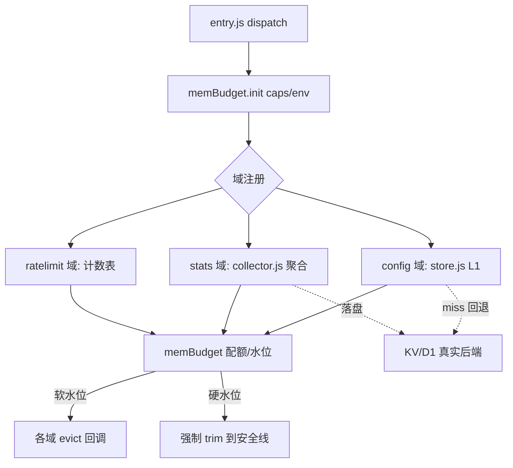

## 用户需求

充分利用边缘运行时（CF/EO/ESA）的 isolate 内存（统一假设 128MB 上限）来减少 KV/D1 的读写次数，同时保证：配置类数据较及时生效、统计/限流可激进缓存、内存不超限、能自回收。

## 产品概述

新增一个统一的 isolate 级内存预算与回收基础设施（memBudget），并将现有三处零散内存缓存（配置 L1 缓存、统计聚合、限流计数）收敛到该基础设施统一管理，实现内存配额分配、水位监控、跨域软/硬水位自回收，从而在不破坏数据面正确性的前提下最大化利用内存、压低 KV/D1 读写。

## 核心特性

- 统一内存预算单例：持有总预算（默认 128MB，可由环境变量 MEM_BUDGET_BYTES 覆盖；平台差异注入 caps），按域（config/stats/ratelimit）分配配额。
- 估算式内存计量：因 V8 边缘运行时无 heap 内省 API，采用「条目数 × 各类平均估算字节（运行采样自校准）+ 条目数硬上限」双约束。
- 水位自回收：软水位（如 70%）触发各域 evict，硬水位（如 90%）强制 trim 到安全线之下，避免平台 OOM 杀 isolate。
- 三域收敛：store.js 把 L1 条目/字节上限交给 memBudget；collector.js 的 MAX_HOSTS 由预算动态给出；ratelimit.js 的 5000 上限改为预算分配值，分钟槽清理改为受水位触发。
- 配置及时反馈：配置 TTL 仍由 configCacheTtl 控制（默认 60s、EO 下限 120s 保护），miss 永远回退真实 KV 后端，不激进延长默认 TTL。
- 可观测：通过 /__health 或 /debug 响应暴露各域配额使用、命中率、估算内存占用。

## 技术栈

- 沿用项目现有栈：纯 JavaScript（ES Module）+ 边缘运行时（workerd/EO V8/ESA V8 同构），无新增依赖。
- 新增模块 `src/platform/memBudget.js`，作为 isolate 级单例；在 `entry.js` 的 `dispatch` 中统一初始化。
- 复用现有 `detectCaps`（平台能力）、`config/store.js` 的 LRU 缓存模式、`stats/collector.js` 的聚合上限模式、`security/ratelimit.js` 的分钟槽清理模式。

## 实现策略

引入 `memBudget` 统一层：每个内存域在初始化时向 memBudget 注册（name + 配额权重 + evict 回调 + 每类估算字节函数）。所有内存写操作前先 `allocBytes`，超限或水位超阈值时由 memBudget 回调各域 `evict(aggressive)`。统计/限流域允许激进 evict（丢失可容忍），配置域仅在硬水位时才 evict 且 miss 回退 KV 保证正确。

### 关键决策与权衡

- 不依赖 heap 探测：三平台 V8 均无 `performance.memory`，改用「估算字节 + 条目硬上限」双约束，估算字节按采样自校准，兼顾可控性与零额外 IO。
- 配置域保守：TTL 不激进，miss 回退 KV，确保及时反馈；仅硬水位才 evict 配置缓存，且 evict 后下次读自动回源。
- 统计/限流激进：5min 落盘、分钟槽清理不变，水位触发即可积极释放，符合现状可容忍近似。

## 性能与可靠性

- alloc/release 为 O(1) Map 操作，零 await，不进请求热路径关键延迟。
- 水位检查按「写入时顺带检查 + 定时/分钟槽触发」进行，避免每请求全量扫描。
- 硬水位强制 trim 到软水位之下，提供兜底保护；条目数硬上限防构造型 key 打爆。
- 复用现有 try/catch 吞错模式，内存层异常绝不影响主链路。

## 实现注意事项

- 只在 `entry.js` 初始化一次 memBudget 单例（按 isolate 缓存），避免重复构造。
- 现有各模块的 `MEM_MAX`/`MAX_HOSTS`/`MEM_MAX_ENTRIES` 改为从 memBudget 获取动态上限，保持向后兼容（旧常量作为兜底默认值）。
- 不改落盘语义、不改 KV/D1 写入路径，仅改内存侧边界与回收触发。
- 文档更新需说明 128MB 假设与 ESA 512MB 企业档的关系（统一按 128 规划，env 可覆盖）。

## 架构设计



## 目录结构

```
src/
├── platform/
│   └── memBudget.js        # [NEW] 统一内存预算单例：配额分配、估算字节计量、软/硬水位、跨域 evict/trim、debug 快照。isolate 级，零 await。
├── platform/caps.js        # [MODIFY] detectCaps 注入 memBudgetBytes（按平台默认 128MB，env MEM_BUDGET_BYTES 可覆盖）。
├── entry.js                # [MODIFY] dispatch 中调用 memBudget.init(caps, env) 一次初始化单例。
├── config/store.js         # [MODIFY] L1 缓存上限改为向 memBudget 申请/释放；TTL 与 miss 回退逻辑不变。
├── stats/collector.js      # [MODIFY] MAX_HOSTS 改为 memBudget 动态上限；聚合仍 5min/阈值落盘；注册 evict 回调。
└── security/ratelimit.js   # [MODIFY] 5000 上限改为 memBudget 分配值；分钟槽清理改为受水位触发；注册 evict 回调。
scripts/
└── test-mem-budget.mjs     # [NEW] 单元脚本：配额分配、水位触发回收、三域收敛后上限随预算变动、预算耗尽 evict 不超总预算。
docs/
├── 06-cache-strategy.md    # [MODIFY] 补充 memBudget 统一内存预算与自回收说明。
└── 11-architecture.md      # [MODIFY] 新增 §4.3 内存预算与自回收设计，说明 128MB 假设与三域收敛。
```

## 关键代码结构

```js
// src/platform/memBudget.js 核心接口（仅签名，无实现体）
export function initMemBudget(opts: { totalBytes: number; env?: Record<string, any> }): void;
export function registerDomain(name: string, cfg: {
  weight: number;
  estimateBytes: (entry: any) => number;
  evict: (aggressive: boolean) => void;
}): void;
export function allocBytes(name: string, estimate: number): boolean;
export function releaseBytes(name: string, estimate: number): void;
export function touchDomain(name: string): void;
export function getBudgetSnapshot(): {
  totalBytes: number; usedBytes: number; softRatio: number; hardRatio: number;
  domains: Record<string, { usedBytes: number; entries: number; quotaBytes: number }>;
};
```