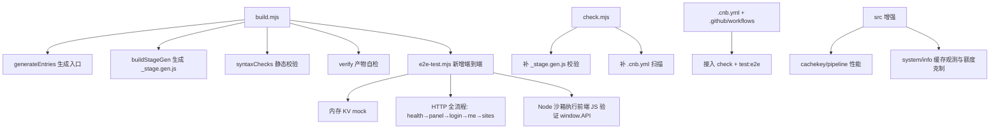

## 需求总览

对 cdn-edge-gateway 项目进行系统性审查加固与能力增强，一次性回应 7 个问题：

### 问题 1：三个前端入口文件能否自包含自动生成

`web/_app.entry.js`、`web/_stage.entry.js` 由 `scripts/gen-entries.mjs` 在 build/check 早期自动生成；`web/_stage.gen.js` 由 `build.mjs` 的 `buildStageGen()` 用 esbuild 从 `_stage.entry.js` 打包生成。三者都只从真实源文件（`web/api.js`、`web/app.js`、`src/config/stages.js`）导出/聚合，不依赖任何手写内容，已被 `.gitignore` 排除。**结论：能自包含自动生成**。但存在一个盲点：`scripts/check.mjs` 只校验 `_stage.entry.js` 和 `_app.entry.js`，未校验 `_stage.gen.js`。

### 问题 2：.gitignore 忽略是否正确

当前忽略 `src/ui.gen.js`、`web/_stage.gen.js`、`web/_app.entry.js`、`web/_stage.entry.js`、`dist/`、`.wrangler/`、`.dev.vars` 等构建产物与本地状态，方向正确。**结论：基本正确**，需确认这些生成文件确实未被提交。

### 问题 3：两个 CI 平台的流水线一致性

GitHub Actions（`.github/workflows` 5 个 workflow）与 CNB（`.cnb.yml`）并存，部署目标是 CF/EO/ESA。存在不一致：GitHub `ci.yml` 已在 build 前接入 `npm run check`，但 CNB 的 `web_trigger_verify` 与 `verify-deploy-config` 未跑 `npm run check`；`check.mjs` 的扫描目标漏了 `.cnb.yml`。

### 问题 4：文档如何随新代码更新

docs 采用 15 篇结构化文档（01 概述→15 ESA MCP），每篇有「上一篇/下一篇」导航。新代码应同步更新对应章节：架构/构建、本地开发与验证、FAQ、部署指南。

### 问题 5：审查未尽事宜

- `check.mjs` 扫描目标漏 `.cnb.yml`（CLOUD_PLATFORM 口径）
- CNB 流水线未接入 `npm run check`
- 前端产物缺少「可执行性」验证（见问题 6）

### 问题 6：build 后结果代码的全面前端测试（核心痛点）

现有 `syntaxChecks` 是**静态**校验（HTML 标签闭合 / JS parse / 括号配对），无法发现「登录后进不去后台」这类**运行时**问题（内联脚本作用域、`window.API` 未挂载、资源引用缺失、登录后鉴权失败等）。需要新增一个 build 后自动执行的**端到端（E2E）+ 沙箱可执行**测试：

- 用 Node 直接 `import` 构建产物 `_worker.js` 的 `default.fetch`/`onRequest`，配内存 KV mock 与平台能力，跑通完整 HTTP 链路：健康检查 → 打开管理面 HTML → POST 登录 → 携带 Cookie 访问 `/auth/me` 与 `/sites`（需鉴权）
- 在 Node 沙箱实际执行产物内联 JS，验证 `window.API` 挂载正常、无运行时语法错误
- 三种部署形态（纯内联 / 静态资源 / ASSETS 绑定切换）全覆盖

### 问题 7：三平台共性 + 特性增强功能与性能，克制免费额度

四个方面：①数据面缓存/回源性能 ②管理面功能增强 ③额度成本控制（静态托管优先、edge 缓存）④平台特性差异化利用（CF R2/EO EdgeCache/ESA 降级）

## 核心交付

- 问题 1/2/4：确认结论并落文档
- 问题 3/5：统一 CI 校验口径、补漏扫描目标
- 问题 6：新增 `scripts/e2e-test.mjs` 端到端测试并接入 build + CI
- 问题 7：数据面性能增强（按平台分派） + 管理面诊断/缓存观测 + 额度克制

## 技术方案

### 1. 问题 1 —— 确认三入口自包含生成

- **结论**：能。`web/_app.entry.js` + `web/_stage.entry.js` 由 `scripts/gen-entries.mjs` 生成；`web/_stage.gen.js` 由 `build.mjs` 步骤 0（esbuild bundle `_stage.entry.js`）生成。
- **加固**：在 `scripts/check.mjs` 的 `checkEntryParseable` 中补上对 `web/_stage.gen.js` 的「存在性 + 可解析」校验（它由 esbuild 生成且被 `web/app.js` import，缺失会导致 build 步骤 0 之后前端 bundle 失败）。同时新增幂等命令：`npm run gen` 显式触发 `generateEntries()`（对齐 `check.mjs` 已有 `--fix` 语义）。

### 2. 问题 2 —— .gitignore 结论确认

- **结论**：正确，无需改动文件本身。
- **落地**：用 `git check-ignore` 验证 4 个生成文件 + `dist/` 确实被忽略；将结论写入文档。

### 3. 问题 3 + 5 —— 双平台流水线口径统一

- `check.mjs` 的 `SCAN_TARGETS` 追加 `.cnb.yml`，让 CNB 里的 `CLOUD_PLATFORM=cf|eo|esa` 赋值也纳入规范值校验。
- `.cnb.yml` 的 `web_trigger_verify` 与 `verify-deploy-config`（`*ci-stages`）在 build 前插入 `npm run check`（保持 CNB `web_trigger_*` 手动触发铁律，与 GitHub 侧 `ci.yml` 对齐）。

### 4. 问题 6 —— build 后端到端 + 沙箱测试（核心）

新增 `scripts/e2e-test.mjs`，复用 `scripts/gen-entries.mjs`、`check.mjs` 的既有模式：

- **内存 KV mock**：实现一个 `KVLike`（`get/put/delete/list` + 编码），`getKV` 已支持 `env.CDN_KV` 鸭子类型，因此只需在测试 env 注入 `CDN_KV: mockKV` 即可复用真实 `store.js` 存储路径（含 keyCodec 编码），不额外造 mock。
- **平台能力注入**：直接复用 `caps.js` 的 `resetCapsCache()` + 传入 `CLOUD_PLATFORM` 环境变量，覆盖 `cf` / `eo` 两种能力集（ESA 因收费在测试中以 `eo` 或纯内联形态覆盖逻辑，不引入厂商 KV）。
- **HTTP 全流程**（用产物 `_worker.js` 的 `default.fetch` 直接调用）：

1. `GET /__health` → 断言 `ok:true`、`hasKV:true`
2. `GET /__panel`（纯内联形态，env 无 ASSETS）→ 断言 HTML 含 `<style>`、内联 `<script>`、`window.__BASE__`
3. `GET /__panel`（有 ASSETS mock 的静态形态）→ 断言引用 `/__panel/assets/app.{css,js}`
4. `GET /__panel/assets/app.js` → 断言返回产物 JS 字节
5. `POST /__panel/api/auth/login` body `{password:'local-dev-pass'}` → 断言 `200` + `Set-Cookie` 存在
6. 携带 Cookie `GET /__panel/api/auth/me` → 断言 `{authed:true}`
7. 携带 Cookie `GET /__panel/api/sites` → 断言 `ok:true`（登录后能进后台）
8. 错误密码登录 → 断言 `401`（鉴权闭环）

- **Node 沙箱执行前端 JS**：`new Function('window', code)` 执行产物内联脚本（或 `dist/public/assets/app.js`），注入 stub `window`（含 `fetch`、`location`、`document` 最小桩），断言执行后 `window.API` 存在且 `typeof window.API.auth.login === 'function'`、`window.API.sites.list === 'function'`——直接捕捉「语法/作用域/未挂载」类运行时错误，这正是用户「登录后进不去后台」的根因。
- **接入方式**：
- `package.json` 新增 `"test:e2e": "node scripts/e2e-test.mjs"`，并让 `build.mjs` 的 `verify()` 末尾（非 `--skip-verify`）自动调用，实现「build 完即全面验证」。
- GitHub `ci.yml` 与 CNB 的 `web_trigger_verify` 在 build 后追加 `npm run test:e2e`。
- 保持 `--skip-verify` 逃生舱。

### 5. 问题 7 —— 平台特性增强 + 性能 + 额度克制

在 `src/platform/caps.js` 已描述的差异（`eoEdgeCache` / `cacheIsNodeLocal` / `cacheSingleInstance` / `cacheSubreqLimit` / `hasR2`）基础上，做**平台特性差异化利用**，全部按 `caps` 分派、保持优雅降级：

- **A. 数据面缓存/回源性能（跨平台共性收益）**
- `src/proxy/cachekey.js`：为 `ignoreQuery` 关闭 + 无 query 的场景，复用「无 query 键」作为缓存键，减少重复回源（需校验不影响语义）。
- `src/platform/cache.js` 的 `isCacheable`：对 `HEAD` 请求也允许读缓存（读路径已支持，写路径保持现状，避免语义扩散）。
- `src/proxy/pipeline.js`：缓存 MISS 回源后，利用 `staleWhileRevalidate` 提前在 TTL 到期前异步刷新（若有 `preRefresh` 配置则触发）。
- **B. 额度成本控制（克制免费额度）**
- 强化「静态资源命中缓存后零函数」：确认 `adminPage.js` 的静态资源分支返回 `immutable` 缓存头（已具备），补充在 `wrangler.toml`/文档中说明 ASSETS 绑定下的静态优先形态。
- `src/proxy/engines/eoEdgeEngine.js`：扩展 EO 路径 A 的适用范围（如仅当可缓存且无自定义 Host 时），已在 pipeline 中体现，测试中补 EO 分支覆盖。
- **C. 管理面功能增强（小而可交付）**
- `src/api/handlers/system.js`：在「系统信息」中新增 `cacheStats`（复用 `getCacheStats()`，展示当前 isolate 命中率）与 `platformCaps` 摘要，帮助用户直观看到「额度消耗/缓存收益」。
- `src/api/handlers/stats.js` 或 `config.js`：新增一个轻量 `GET /system/health` 或复用现有 `/system/info`，暴露 KV 后端类型（`kvBackend`）以便用户判断是否走收费 EdgeKV（克制额度）。

### 6. 问题 4 —— 文档同步更新

- `docs/09-local-development.md`：新增「构建后自动测试」小节，说明 `npm run build` 内置 E2E、`npm run test:e2e` 手动触发。
- `docs/08-faq.md`：新增「build 成功但登录进不去后台」排查指引（指向 E2E 测试与沙箱执行）。
- `docs/11-architecture.md`：目录结构补 `scripts/e2e-test.mjs`；缓存/平台差异章节补充问题 7 的增强。
- `docs/03-deploy.md`：说明 GitHub 与 CNB 双 CI 的 check/e2e 接入点。

## 性能与可靠性

- E2E 测试是**一次性本地开销**（毫秒级内存 KV），不打生产链路；`build.mjs` 的 verify() 串行追加一次，构建时长增加 <2s。
- 沙箱执行用 `new Function` 且注入 stub `window`，不引入外部依赖（避免 Playwright 等重依赖），零网络、零浏览器。
- 所有平台差异分支按 `caps` 分派 + 既有降级链（KV→Redis→none），不破坏现行为。
- 保持所有 workflow `workflow_dispatch` 手动触发铁律。

## 架构设计

本次改动为「加固 + 增量增强」，在既有分层（entry → core/app → api/ *+ proxy/* → platform/*）内追加，不引入新架构模式：



## 目录结构

```
project-root/
├── scripts/
│   └── e2e-test.mjs          # [NEW] build 后端到端测试：内存 KV mock + HTTP 全流程（health/panel/login/me/sites）+ Node 沙箱执行前端 JS 验证 window.API。供 build.mjs verify() 与 CI 复用。含--skip 逃生舱。
├── scripts/
│   └── check.mjs             # [MODIFY] checkEntryParseable 增加 web/_stage.gen.js；SCAN_TARGETS 追加 .cnb.yml。
├── build.mjs                 # [MODIFY] verify() 末尾调用 runE2E（非 --skip-verify）；可选新增 step 编号注释。
├── package.json              # [MODIFY] 新增 "test:e2e"、"gen" 脚本。
├── .cnb.yml                  # [MODIFY] *ci-stages 的 build 前加 npm run check，build 后加 npm run test:e2e；verify-deploy-config 保持。
├── .github/workflows/
│   └── ci.yml                # [MODIFY] build 后追加 npm run test:e2e（与 CNB 对齐）。
├── src/
│   ├── proxy/
│   │   └── cachekey.js       # [MODIFY] 无 query + ignoreQuery 关闭时复用无 query 缓存键（性能）。
│   ├── platform/
│   │   └── cache.js          # [MODIFY] isCacheable 允许 HEAD 读缓存；必要时暴露命中率辅助。
│   └── api/handlers/
│       └── system.js         # [MODIFY] /system/info 增加 cacheStats + kvBackend + platformCaps 摘要（额度观测）。
└── docs/
    ├── 03-deploy.md          # [MODIFY] 双 CI check/e2e 接入点说明。
    ├── 08-faq.md             # [MODIFY] build 成功但登录进不去后台的排查指引。
    ├── 09-local-development.md # [MODIFY] 新增「构建后自动测试」小节。
    └── 11-architecture.md    # [MODIFY] 目录结构补 e2e-test.mjs；缓存/平台差异章节补充。
```

## 关键接口约束

- E2E 测试的 mock KV 必须实现 `KVLike`：`get(key,type)` / `put(key,val,opts)` / `delete(key)` / `list(opts)`，且 `getKV` 经 `env.CDN_KV` 鸭子类型命中——与 `src/platform/kv.js` 契约一致。
- E2E 环境变量：`CLOUD_PLATFORM=cf|eo`（经 `process.env` 注入 caps，测试结束调用 `resetCapsCache()`）。
- 沙箱执行 `new Function('window', code)` 时注入 stub `window` 需含 `fetch`、`location`、`document` 的最小桩，避免 app.js 顶层 IIFE 访问未定义全局而抛错。
- `build.mjs` 的 `--skip-verify` 同时跳过 E2E，作为调试逃生舱；CI 与默认 build 均不跳过。

## 可用 Agent 扩展

### SubAgent

- **code-explorer**
- 用途：在计划执行阶段，对问题 7 涉及的数据面缓存路径（cachekey/cache/pipeline）与问题 6 的产物消费路径（adminPage 静态/内联/ASSETS 三形态）做多文件交叉确认，确保测试断言与真实契约一致。
- 预期产出：精确的缓存键构造规则、HEAD 缓存读路径、ASSETS 绑定切换的完整调用链，作为 e2e-test.mjs 与性能增强的落地依据。

### Skill

- **cloudflare**
- 用途：校验 Workers/Pages 的 ASSETS 绑定、KV 绑定、Cache API 语义，确保 E2E 的 mock KV 与 ASSETS 分支断言符合 Cloudflare 运行时行为。
- 预期产出：E2E 测试中 ASSETS 绑定切换分支的正确实现参考。

- **edgeone-makers-tools**
- 用途：确认 EO 路径 A「同站 fetch 委托节点缓存」的三条件与触发语义，确保问题 7 中 EO 分支的性能增强与 E2E 的 EO 能力集覆盖准确。
- 预期产出：EO 路径 A 的正确触发条件与测试覆盖点。

- **alibabacloud-esa-pages-deploy**
- 用途：确认 ESA 的 EdgeKV 收费语义与全局 cache 单实例行为，确保问题 7 中 ESA 平台的额度克制（禁厂商 KV、走 REDIS_URL）与缓存差异分支正确。
- 预期产出：ESA 分支的缓存/存储增强点与测试不引入收费 EdgeKV 的依据。

> 说明：这些扩展仅作为计划执行期参考平台官方语义使用；E2E 测试本体仅依赖 Node 内置能力，不引入浏览器或厂商 SDK 重依赖。