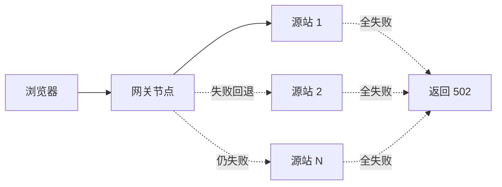

# 502 错误说明

> [!NOTE]
> **本文面向**：所有人（排障）。当你访问经过网关的资源看到 502，按本文排查。

---

## 一、502 是什么

**502 Bad Gateway（网关错误）** = 网关（cdn-edge-gateway 边缘节点）连不上它背后的源站。

对我们这个项目来说，这是一个「数据面回源失败」的兜底信号：
请求走到了网关，网关按负载均衡选了一个源站去 `fetch`，但**所有源站（含链式回退的下一个）都连不上 / 超时 / 返回不可恢复错误**，
于是网关返回 502，并展示一个「仿 Cloudflare 风格」的伪装错误页（由 `src/errorPage.js` 在运行时生成）。



---

## 二、先确认：是源站挂了，还是网关没连上

| 现象 | 大概率是 | 下一步 |
|---|---|---|
| 直连源站 IP 也打不开 | 源站自身挂了 | 先修源站 |
| 直连源站正常，但走网关 502 | 网关连不上源站（防火墙/网络/证书） | 看第三节 |
| 只有某个域名 502，其它正常 | 该站点源站配置错了 | 查该 site 的 origin |
| 偶发 502，过会儿好 | 源站抖动 / 瞬时过载 / 熔断中 | 看熔断与超时配置 |

---

## 三、排障清单（按顺序查）

1. **源站是否在线**
   ```bash
   curl -v https://你的源站域名/health
   ```
   如果源站自己就 5xx / 连不上，先修源站。

2. **源站防火墙是否放行边缘节点 IP**
   - CF：放行 [Cloudflare IP 段](https://www.cloudflare.com/ips/)。
   - EO：放行 EdgeOne 回源 IP。
   - ESA：放行 ESA 节点 IP。
   - 这是 502 最常见根因：源站只对自己的 IP 开放，网关的节点 IP 被挡。

3. **源站域名能否解析**
   网关是按 site 配置里的 `origin`（域名或 IP）回源的。
   如果 origin 填的是域名但 DNS 解析不了 → 530/502。
   在节点侧 `dig 你的源站域名` 确认能解析。

4. **SSL 证书**
   origin 用 `https` 时，源站证书必须有效且套件匹配，否则 525/526。
   自签证书需把 CA 加进源站信任链（平台侧操作）。

5. **超时设置**
   默认 `connectTimeoutMs=10000`、`readTimeoutMs=30000`。
   源站响应慢（>30s）会 504/502。调大 `defaultUpstreamTimeoutMs` 或优化源站。

6. **被动熔断**
   若 `enableCircuitBreaker=true` 且某源站短时间失败超 `circuitBreakerThreshold` 次，
   该源站会被「熔断」一段时间（半开探测恢复）。熔断期间请求被导到其他源站，
   若全部熔断 → 502。见 [开发者篇·系统架构](/dev/11-architecture.md) 的熔断小节。

---

## 四、502 错误页（前端展示）

网关返回的 502 兜底页由 `src/errorPage.js` 的 `buildErrorPage()` 在**运行时生成**（HTML 字符串，随响应返回），其结构与视觉**对齐已在用的 Nginx 静态 502 页**（`backup/docs/502.html`，原始样例存档），并做了「更像真实 Cloudflare」的改造：
- 展示域名、Ray ID（**16 位十六进制**，格式对齐真实 CF Ray ID）、**边缘节点大区代码**（真实 CF 风格，如 `HKG` / `SJC-04` / `NRT` 等，不再是原样例里的原神地名）、UTC 时间戳；
- 标明 Browser / Cloudflare(节点) 正常、**Host(源站) 异常**；
- 页脚「Your IP: Click to reveal」：点击后通过**同源** `/cdn-cgi/trace` 拉取访客真实 IP 显示（该端点由 Cloudflare 边缘直接响应，**不经过本 Worker**，因此不增加 Workers 请求数）；
- 提示「几分钟后重试」；
- 内联样式替代原样例外链的 `main.css`，离线可用、无外部可观测信号。

> 防盗刷 / 防探测：
> 1. Ray ID 与大区均为「格式真实」的随机值，让扫描器误以为是真实 Cloudflare 边缘在拦截，难以据此判断真实架构；
> 2. **响应头 `Cache-Control: public, max-age=60, s-maxage=60`**：失败路径（被探测的坏 URL 等）会被 Cloudflare 边缘缓存 60s，命中后不再进入 Worker，避免反复消耗 Workers 请求数。

> [!TIP]
> 这是给用户看的「体面错误页」。真正的排障看上面第三节，不要被页面的「Cloudflare」字样误导——
> 本项目跑在 CF/EO/ESA 任一平台，502 都表示「你的源站连不上」。

---

## 五、网关返回 502 的代码位置

数据面回源失败时，核心流程：
选源（`src/balancer/`）→ 回源（`src/proxy/engines/fetchEngine.js` 的 `fetchOrigin`，失败时抛 `UpstreamError(502)`）→ 全部源站失败 → 异常冒泡到 `src/entry.js` 最外层兜底 → 按 `appErr.status` 调用 `src/errorPage.js` 的 `buildErrorPage()` 返回伪装错误页（HTML，状态码 502/503/500）。

若想自定义伪装页样式，改 `src/errorPage.js` 的 `buildErrorPage()`；原始借鉴样例保留在 `backup/docs/502.html`。
