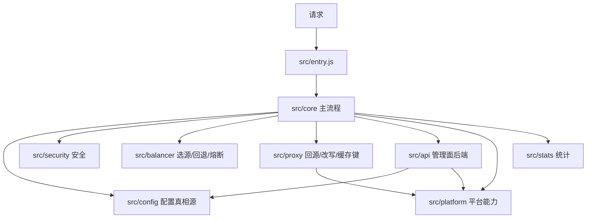
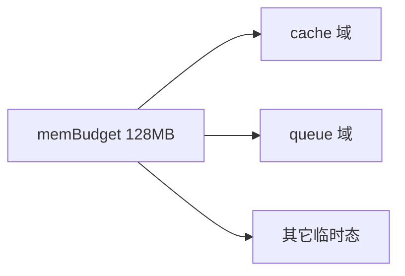
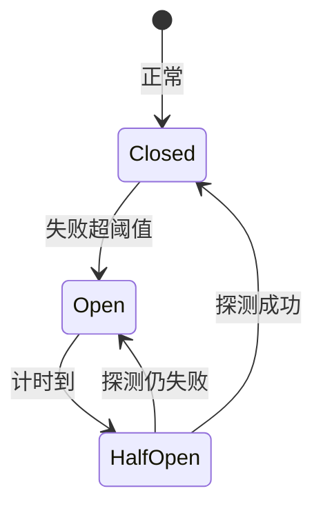

# 11 · 系统架构

> [!NOTE]
> **本文面向**：开发者（理解模块划分、平台降级、内存预算）。
> 请求每一步的链路见 [请求流程](/dev/12-request-flow.md)。

---

## 整体分层

| 模块 | 职责 |
|---|---|
| `src/entry.js` | 运行时入口，分发数据面请求 / 管理面请求 / 静态资源 |
| `src/core/` | 主流程编排（匹配→安全→规则→选源→回源→改写） |
| `src/config/` | 配置读取（KV + 内存缓存 30s）、schema 校验、baked 烘焙兜底。**字段真相源** |
| `src/security/` | 防盗链 / IP / UA / 限流 |
| `src/balancer/` | 负载均衡策略、链式回退、被动熔断 |
| `src/proxy/` | 回源 engines、头改写、路径重写、缓存键、缓存封装 |
| `src/api/` | 管理面后端（`/{adminPath}/api/*`）+ 静态页优先服务 |
| `src/platform/` | 平台能力探测 caps、cache 封装、Redis(Webdis) KV 兜底 |
| `src/stats/` | 请求统计 |
| `src/utils/` | 通用工具 |

---

## 配置真相源（重要）

`src/config/schema.js` 是唯一字段真相源；`src/config/store.js` 负责：

1. 优先读 **baked 烘焙配置**（`STATIC_CONFIG=1` 时；ESA 在未配 `REDIS_URL` 时默认如此）；
2. 否则读 **KV**——由 `KV_BACKEND` 在「自部署 Webdis（`REDIS_URL`）」与「平台 KV（`CDN_KV`）」间选型，
   **两者并存时默认优先 Webdis**，详见 [Redis / Webdis 外置 KV](/dev/13-redis-kv.md)；
3. 内存缓存 **30s**（`kvTtlSeconds`/`kvRefreshStaleSeconds`），陈旧期内返回旧值，后台刷新。

> [!NOTE]
> 单轨化后全局配置只剩 **31 字段**，隐藏字段盘点见 [附录 · 隐藏配置字段](/appendix/hidden-fields.md)。
> **签名 URL 已删除**，不要在任何配置里写 `security.signedUrlParam`/`signedUrlTtl`。

---

## 平台降级（三平台能力差异）

`src/platform/caps.js` 在启动时探测能力，代码全程按 caps 分支：

| 能力 | cf | eo | esa |
|---|---|---|---|
| TCP 回源 (hasSocket) | ✅ | ❌ | ❌ |
| 裸 IP fetch (hasRawIpFetch) | ✅ | ✅ | ❌ |
| D1 | ✅ | ❌ | ❌ |
| R2 | ✅ | ❌ | ❌ |
| 原生 KV | ✅ (CDN_KV) | ✅ (CDN_KV) | ❌（禁用 EdgeKV，走 REDIS_URL/烘焙） |
| 外置自部署 Webdis | ✅ (REDIS_URL) | ✅ (REDIS_URL) | ✅ (REDIS_URL) |
| cache 全局单例 | ❌ | ❌ | ✅ |
| cache 节点本地 | ❌ | ✅ | ❌ |
| cacheKey 须 http | ❌ | ❌ | ✅ |
| 每请求子请求上限 | **50**（内置默认对齐 Free 档硬限；Paid=1000 可经 MAX_SUBREQUESTS 覆盖） | **100**（官方未单列硬限，取免费档近似上限避免无限大） | **4**（官方 fetchAPI「4 个」与 Cache API「32 个」冲突，保守取 4，待实测） |
| 内存预算 | 128MB | 128MB | 128MB |

**降级含义**：

- EO 支持裸 IP fetch（官方 Fetch 文档未禁止裸 IP，标准 fetch 行为）；仅 EO 无可编程 TCP，
  「HTTPS + 裸 IP + 自定义 SNI」需走 **EO 平台源站组 + 回源 Host** 兜底（代码层不建 socket）。
- ESA 无裸 IP fetch（官方明确不支持）→ 源站必须填**可解析域名**（不能用 IP 直连回源）。
- ESA 无原生 KV → 配置走 **REDIS_URL (Webdis)** 或**静态烘焙**，不能依赖运行时 KV。
  （CF / EO 亦可配 `REDIS_URL` 使用同一份外置 Webdis，且**并存时默认优先 Webdis**。）
- ESA cache 全局单例 + key 须 http → `put` 用 http URL，自动降级。
- ESA 子请求上限 **4**（保守值，官方两处文档冲突待实测）→ 管理面站点数多时单请求会逼近上限，需分页（见 [部署 ESA](/dev/14-deploy-esa.md) 与 [平台隐藏限制](/dev/17-platform-limits.md)）。

---

## EO Makers V8 运行时约束

EdgeOne **Makers** 的 Edge Functions 运行在 **V8 运行时**（与 Cloudflare Workers 同代），与 Node.js 有本质差异，代码必须规避两类陷阱：

1. **没有 `node:` 内建模块**
   - ❌ 错误：`import { webcrypto } from 'node:crypto'`（顶层静态 import）。V8 无 `node:crypto`，Makers 构建期直接 `Could not resolve "node:crypto"`，**整个 edge function 层无法挂载**，`/{adminPath}` 返回 404 网关页。
   - ✅ 正确：用标准 WebCrypto `globalThis.crypto`（`crypto.subtle` / `getRandomValues`），三平台（CF / EO / ESA）均原生提供。`src/config/schema.js` 的 `generateRandomId` 已优先使用它，随机源兜底不再静态 import `node:crypto`。

2. **`process` 全局不一定存在**
   - ❌ 错误：顶层裸 `const x = process.env.ESA_KV_NAMESPACE`。V8 未定义 `process` 时直接 `ReferenceError: process is not defined`，同样导致函数层不挂载。
   - ✅ 正确：用 `typeof process !== 'undefined'` 守卫读取（或 `src/platform/caps.js` 的 `safeGlobal('process')`）。`src/platform/kv.js` 已改为该写法，CF 下仍照常读取 `process.env`。

3. **单运行时收口全请求**
   - 因 **EO KV 仅在 Edge Functions 可用**，全部请求（数据面代理 + 管理面 `/{adminPath}`）都走 Edge Function（`edge-functions/[[default]].js` 薄壳 → `_worker.js`），不拆 Cloud Function。管理面 UI 静态资源由 Makers 静态层托管，命中缓存后零函数执行。

> [!NOTE]
> **构建额度提示**：`edgeone makers deploy <目录>` 默认会对该目录**云端重新构建**并消耗构建额度。本项目通过「本地 `npm run build` + `package-eo.mjs` 先生成 `dist-eo/` 产物，再 `edgeone makers deploy dist-eo` 上传」规避云端 rebuild，从而几乎不耗构建额度。若图省事直接 `deploy .`，CLI 会自动云端构建、仍耗额度。

> [!NOTE]
> 这些约束的修复对 Cloudflare 路径**零回归**：CF Workers 同样支持 WebCrypto，`process` 守卫在 CF 下正常生效。验证见 [部署指南 · 路线 C](/user/03-deploy.md)。

---

## 配置同步：KV 冷启动全量加载 + 内存快照 + 版本感知重拉

配置（含 `adminPath`、源站池、站点族、全局规则）持久化在 KV，但**运行时数据面几乎不碰 KV**（`src/config/store.js`）：

1. **冷启动一次性全量加载**：isolate 首请求时 `loadConfigSnapshot` 把固定 5 个合并键（`cfg:version` / `cfg:global` / `cfg:global_rules` / `cfg:sites` / `cfg:pools`）全量读进内存 `_snapshotState`。之后数据面只读内存，**不再访问 KV**。
2. **版本感知后台重拉**：每个请求末尾由 `ctx.waitUntil` 触发 `reconcileVersion`（不阻塞响应），按 `cfg:version` 版本号做比对：
   - **分档线性回退**读版本号（2s 起步 → 600s 封顶，理想静态约 4 小时达上限；`expireAt` 未过期时直接短路、**零 KV 读**）。
   - **仅版本号变化**才 `reloadConfigSnapshot` 整体重拉快照进内存；版本号不变则无事。
   - **并发去重**（`_reconcileInFlight`）：同一 isolate 同一时刻只跑一次比对，避免打爆 KV 读额度。
3. **影响**：在管理面改 `adminPath` 写入 KV（自动 `bumpVersion`）后，各 isolate 在版本号收敛窗口内自动感知新前缀——**无需重新部署、无需重启**。这与「自定义 adminPath 动态渲染、无需重新构建」的运行模型直接对应（见 [部署指南 · 路线 C](/user/03-deploy.md)）。

> [!NOTE]
> EO Makers 的 Edge Function 同样适用该机制：`cfg:version` 比对走的是 KV 读（受退避限流），重拉后的快照是 isolate 内存态，符合 EO「KV 仅在 Edge Functions 可用」的约束。

---

## 内存预算（memBudget）

`src/platform/memBudget.js` 把「缓存 + 队列 + 其它临时态」统一注册到一块内存预算里，
默认按 **128MB** 估算（`env.MEM_BUDGET_BYTES` 可覆盖，ESA 在 `esa.jsonc` 设）。

- 各内存域（cache/queue/...）向预算申请额度，超预算时按策略淘汰（如 LRU）。
- 这是「在边缘小内存里安全跑缓存」的关键机制，避免 OOM 把节点打挂。

> [!TIP]
> 线上若报内存相关错误，优先看 `MEM_BUDGET_BYTES` 是否设合理，以及缓存 TTL 是否过大。

---

## 被动熔断（circuit breaker）

`src/balancer/` 实现：源站短时间失败超 `circuitBreakerThreshold` 次（默认 5），该源站被**熔断**
一段时间（`circuitBreakerResetMs` 默认 60s，半开探测恢复）。

熔断是**保护**机制：源站抖动点会暂时导流到其它源站/回退链，避免雪崩。

---

## 下一步

→ [请求流程](/dev/12-request-flow.md)：一次请求从进来到出去的完整链路。
