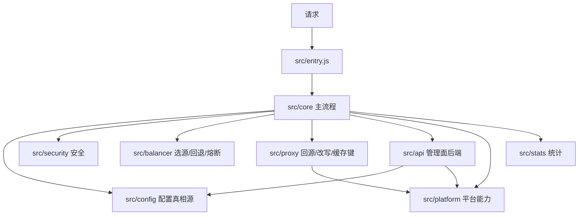
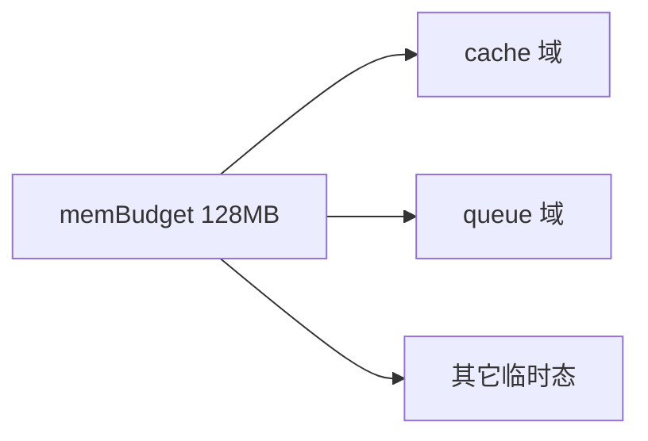
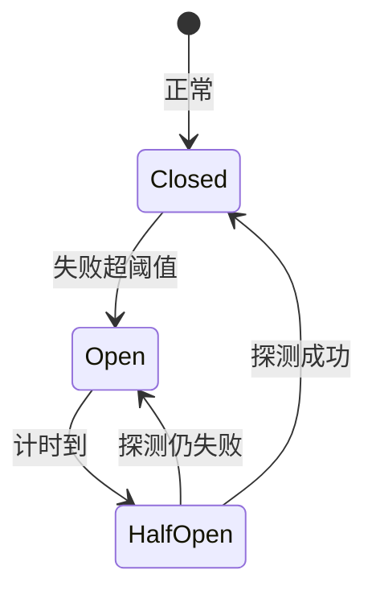

# 11 · 系统架构

> [!NOTE]
> **本文面向**：开发者（理解模块划分、平台降级、内存预算）。
> 请求每一步的链路见 [请求流程](/dev/12-request-flow.md)。

---

## 整体分层

| 模块 | 职责 |
|---|---|
| `src/entry.js` | 运行时入口，分发数据面请求 / 管理面请求 / 静态资源 |
| `src/core/` | 主流程编排（匹配→安全→规则→选源→回源→改写） |
| `src/config/` | 配置读取（KV + 内存缓存 30s）、schema 校验、baked 烘焙兜底。**字段真相源** |
| `src/security/` | 防盗链 / IP / UA / 限流 |
| `src/balancer/` | 负载均衡策略、链式回退、被动熔断 |
| `src/proxy/` | 回源 engines、头改写、路径重写、缓存键、缓存封装 |
| `src/api/` | 管理面后端（`/{adminPath}/api/*`）+ 静态页优先服务 |
| `src/platform/` | 平台能力探测 caps、cache 封装、Redis(Webdis) KV 兜底 |
| `src/stats/` | 请求统计 |
| `src/utils/` | 通用工具 |

---

## 配置真相源（重要）

`src/config/schema.js` 是唯一字段真相源；`src/config/store.js` 负责：

1. 优先读 **baked 烘焙配置**（ESA `STATIC_CONFIG=1` 时）；
2. 否则读 **KV**（CDN_KV）；
3. 内存缓存 **30s**（`kvTtlSeconds`/`kvRefreshStaleSeconds`），陈旧期内返回旧值，后台刷新。

> [!NOTE]
> 单轨化后全局配置只剩 **31 字段**，隐藏字段盘点见 [附录 · 隐藏配置字段](/appendix/hidden-fields.md)。
> **签名 URL 已删除**，不要在任何配置里写 `security.signedUrlParam`/`signedUrlTtl`。

---

## 平台降级（三平台能力差异）

`src/platform/caps.js` 在启动时探测能力，代码全程按 caps 分支：

| 能力 | cf | eo | esa |
|---|---|---|---|
| TCP 回源 (hasSocket) | ✅ | ❌ | ❌ |
| 裸 IP fetch (hasRawIpFetch) | ✅ | ❌ | ❌ |
| D1 | ✅ | ❌ | ❌ |
| R2 | ✅ | ❌ | ❌ |
| 原生 KV | ✅ (CDN_KV) | ✅ (CDN_KV) | ❌（禁用 EdgeKV，走 REDIS_URL/烘焙） |
| cache 全局单例 | ❌ | ❌ | ✅ |
| cache 节点本地 | ❌ | ✅ | ❌ |
| cacheKey 须 http | ❌ | ❌ | ✅ |
| 每请求子请求上限 | 1000 | 1000 | **32**（Cache 与 fetch 共享） |
| 内存预算 | 128MB 假设 | 128MB 假设 | 128MB（esa.jsonc） |

**降级含义**：

- EO 无裸 IP fetch → 源站必须填**可解析域名**（不能用 IP 直连回源）。
- ESA 无原生 KV → 配置走 **REDIS_URL (Webdis)** 或**静态烘焙**，不能依赖运行时 KV。
- ESA cache 全局单例 + key 须 http → `put` 用 http URL，自动降级。
- ESA 子请求上限 **32** → 管理面站点数多时单请求会逼近上限，需分页（见 [部署 ESA](/dev/14-deploy-esa.md)）。

---

## 内存预算（memBudget）

`src/platform/memBudget.js` 把「缓存 + 队列 + 其它临时态」统一注册到一块内存预算里，
默认按 **128MB** 估算（`env.MEM_BUDGET_BYTES` 可覆盖，ESA 在 `esa.jsonc` 设）。

- 各内存域（cache/queue/...）向预算申请额度，超预算时按策略淘汰（如 LRU）。
- 这是「在边缘小内存里安全跑缓存」的关键机制，避免 OOM 把节点打挂。

> [!TIP]
> 线上若报内存相关错误，优先看 `MEM_BUDGET_BYTES` 是否设合理，以及缓存 TTL 是否过大。

---

## 被动熔断（circuit breaker）

`src/balancer/` 实现：源站短时间失败超 `circuitBreakerThreshold` 次（默认 5），该源站被**熔断**
一段时间（`circuitBreakerResetMs` 默认 60s，半开探测恢复）。

熔断是**保护**机制：源站抖动点会暂时导流到其它源站/回退链，避免雪崩。

---

## 下一步

→ [请求流程](/dev/12-request-flow.md)：一次请求从进来到出去的完整链路。
