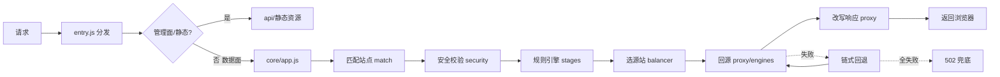
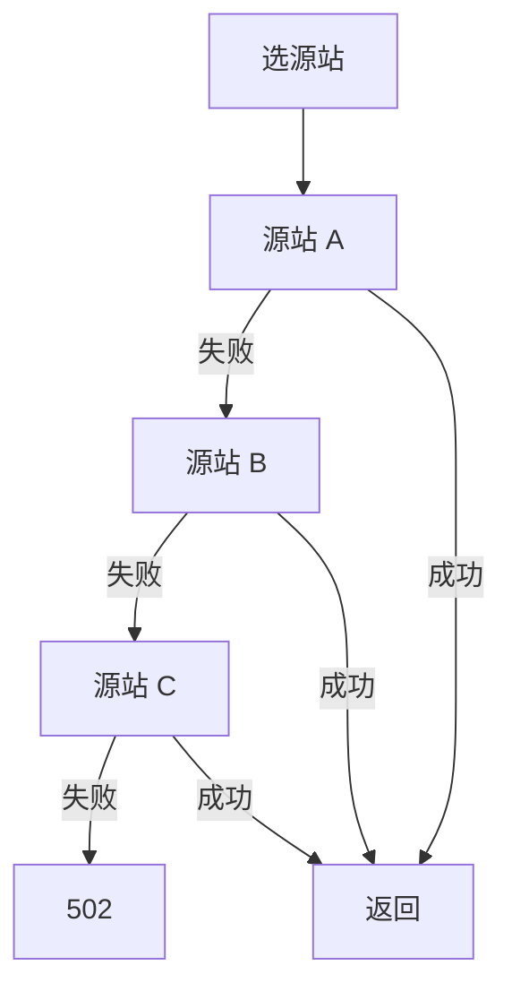

# 12 · 请求处理流程

> [!NOTE]
> **本文面向**：开发者（理解一次请求从进来到出去的完整链路）。
> 模块职责见 [系统架构](/dev/11-architecture.md)。

---

## 总链路



---

## 入口分发（src/entry.js）

按 URL 分流：

| 路径 | 处理 |
|---|---|
| `/{adminPath}/assets/*` | 平台静态托管（零函数调用） |
| `/{adminPath}` 或 `/{adminPath}/index.html` | 管理面 HTML（优先 `dist/public/index.html`，缺失回退 `UI_HTML` 内联） |
| `/{adminPath}/api/*` | 管理面后端（见 [API 参考](/dev/10-api-reference.md)） |
| `/{adminPath}/__health` | 健康检查 |
| 其它 | 数据面请求，进 `core/app.js` |

---

## 数据面阶段（src/core/app.js）

严格按下面顺序执行（代码常量 `STAGE_ORDER`），当前规则阶段只有 7 个：

```
rewrite(URL重写) → redirect(重定向) → terminate(强制HTTPS/直接响应)
→ reqHeaders(改请求头) → origin(回源规则) → cache(缓存规则) → respHeaders(改响应头)
```

全站级默认（全局通用规则）独有 3 个阶段：`match` / `security` / `error`。

| 阶段 | 做什么 | 中断？ |
|---|---|---|
| `match` | 按 host/条件匹配站点（全站默认） | — |
| `security` | 防盗链/IP/UA/限流校验（全站默认） | 命中即拒（403/401/429） |
| `rewrite` | 改写 URL（路径/查询串） | 否 |
| `redirect` | 返回 301/302/307 | 是（直接响应） |
| `terminate` | 强制 HTTPS / 直接返回固定响应 | 是 |
| `reqHeaders` | 给回源请求加/删/改头 | 否 |
| `origin` | 动态换源站池（按条件分流） | 否 |
| `cache` | 缓存规则（是否缓存、TTL、缓存键） | 否 |
| `respHeaders` | 给响应加/删/改头 | 否 |
| `error` | 错误处理默认（全站默认） | — |

> [!TIP]
> `redirect`/`terminate` 会**中断**后续阶段（直接返回）；`origin`/`cache` 只改参数，请求继续往后走。

---

## 选源与回退（src/balancer）

1. 按站点/规则的 `poolId`、`strategy` 选源站（round_robin/random/weighted/hash/least_conn）。
2. 回源 `fetch` 失败（连不上/超时/不可恢复错误）→ **链式回退**到 `priority` 下一个源站。
3. 全部失败 → 返回 **502** 兜底响应（见 [附录 · 502](/appendix/502.md)）。



> [!NOTE]
> 被动熔断见 [系统架构 · 被动熔断](/dev/11-architecture.md)：反复失败的源站会被临时拉黑。

---

## 回源与缓存键（src/proxy）

- `engines/`：按源站类型回源（http/https；EO 无裸 IP fetch 必须填域名）。
- 缓存键（cacheKey）：由 URL + 可配置查询参数 + 头构成，规则可定制。
- 命中缓存则直接返回，不进源站（CF 还可能命中平台级 Workers Cache，连函数都不进）。

---

## 响应改写

`respHeaders` 阶段给响应加/删/改头；同时网关统一加调试响应头：
`X-Cache`（HIT/MISS/PASS）、`X-Origin-Addr`、`Server: EdgeGateway`、`Via`、`X-Egw-Req-Id`。

---

## 调试切入点

| 想查 | 看哪 |
|---|---|
| 请求是否进对某站点 | `match` 阶段 + 响应头 `X-Egw-Req-Id` |
| 回源到哪台 | `X-Origin-Addr` |
| 是否命中缓存 | `X-Cache` |
| 为什么 502 | 回源日志 + [502 附录](/appendix/502.md) |

---

## 下一步

→ [Redis KV 兜底](/dev/13-redis-kv.md)：ESA 等无原生 KV 平台怎么存配置。
