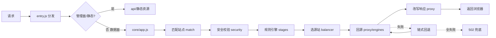
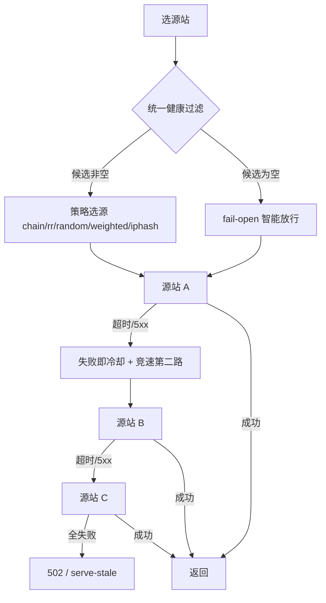

# 12 · 请求处理流程

> [!NOTE]
> **本文面向**：开发者（理解一次请求从进来到出去的完整链路）。
> 模块职责见 [系统架构](/dev/11-architecture.md)。

---

## 总链路



---

## 入口分发（src/entry.js）

按 URL 分流：

| 路径 | 处理 |
|---|---|
| `/{adminPath}/assets/*` | 平台静态托管（零函数调用） |
| `/{adminPath}` 或 `/{adminPath}/index.html` | 管理面 HTML（优先 `dist/public/index.html`，缺失回退 `UI_HTML` 内联） |
| `/{adminPath}/api/*` | 管理面后端（见 [API 参考](/dev/10-api-reference.md)） |
| 其它 | 数据面请求，进 `core/app.js` |

---

## 数据面阶段（src/core/app.js）

严格按下面顺序执行（代码常量 `STAGE_ORDER`），当前规则阶段只有 7 个：

```
rewrite(URL重写) → redirect(重定向) → terminate(强制HTTPS/直接响应)
→ reqHeaders(改请求头) → origin(回源规则) → cache(缓存规则) → respHeaders(改响应头)
```

全站级默认（全局通用规则）独有 3 个阶段：`match` / `security` / `error`。

| 阶段 | 做什么 | 中断？ |
|---|---|---|
| `match` | 按 host/条件匹配站点（全站默认） | — |
| `security` | 防盗链/IP/UA/限流校验（全站默认） | 命中即拒（403/401/429） |
| `rewrite` | 改写 URL（路径/查询串） | 否 |
| `redirect` | 返回 301/302/307 | 是（直接响应） |
| `terminate` | 强制 HTTPS / 直接返回固定响应 | 是 |
| `reqHeaders` | 给回源请求加/删/改头 | 否 |
| `origin` | 动态换源站池（按条件分流） | 否 |
| `cache` | 缓存规则（是否缓存、TTL、缓存键） | 否 |
| `respHeaders` | 给响应加/删/改头 | 否 |
| `error` | 错误处理默认（全站默认） | — |

> [!TIP]
> `redirect`/`terminate` 会**中断**后续阶段（直接返回）；`origin`/`cache` 只改参数，请求继续往后走。

---

## 选源与回退（src/balancer）

### 3 种调度策略

| 策略 | 选源算法 | 增强要点 |
|---|---|---|
| `chain` | **严格串行**：取候选里 `order` 最小者（无权重、无轮询状态） | order 从 1 起，越小越优先；某源站失败时由故障转移层排除它，下一次自然选 order 次小的，实现 1→2→3→4 严格串行回退。坏源站排除后**剩余可用源站按 order 依次顶上** |
| `weighted` | **平滑加权轮询（SWRR）** | 按 `weight` 平滑分配；未填 `weight` 时按 order 派生默认权重（`池内最大 order − (order−1) + 1`，全相等即均分），行为与原 chain 派生一致 |
| `iphash` | 一致性哈希环 + 虚拟节点 | 2^32 环 + 每源站 128 虚拟节点，增删源站键迁移最小；命中坏源站环内顺时针回退；回退结果按 IP 软亲和缓存 60s，避免每请求重复走回退 |

> 策略层只负责「怎么选」（chain 取最小 order / weighted 平滑加权 / iphash 哈希环）。健康过滤与**故障转移（failover）回退链**是横切逻辑，对所有策略生效：某源站回源失败后排除它、再按当前策略选下一个，全部失败才 502。`chain` 的串行顺序正是由「策略取最小 order + 故障转移排除已试」共同实现的，本身与权重无关。

### 统一横切逻辑（所有策略共享）

1. **统一健康过滤**：`enabled` + 已试（excludeIds）+ 熔断（KV）+ 冷却（内存）。候选集为空 → **fail-open 智能放行**：优先挑「最近成功时间最新 / 冷却剩余最短」的源站，提高豁免一击命中率。
2. **失败即冷却**：一次回源失败立即把源站放入本 isolate 冷却名单（默认 15s，纯内存、零 KV），与「60s 内累计 3 次熔断」并存互补。
3. **总时间预算**：按平台执行上限推导硬顶（`caps.maxExecutionMs` − 安全余量），每次尝试超时递减，最坏总耗时收敛到 `budget`，避免 `(换源次数+1)×超时` 撞平台墙钟。
4. **竞速请求**：首个尝试超过 `speculativeMs`（默认 500ms）无首字节，立即并行打第二个候选源站，谁先成功用谁（仅 GET/HEAD 及已物化 body 请求启用，双写安全）；慢路 `abort` 取消，不记冷却。
5. **冷却软恢复**：冷却到期源站以低权重（×0.3）试水，连续成功恢复满权重；试水期再失败立即重回冷却，避免恢复瞬间流量蜂拥。
6. 全部源站失败 → 返回 **502**；若命中边缘缓存则 **serve-stale** 兜底（见 [附录 · 502](/appendix/502.md)）。



### 状态语义边界（KV 读写克制）

为兼顾「KV 读写克制」「内存单边缘生效」「KV 读写延迟」三者，采用**状态分级、快慢分离**：

| 状态 | 窗口 | 存储 | 说明 |
|---|---|---|---|
| 冷却 / 最近成功 / 软恢复 / 软亲和 | 短窗 / 启发式 | **纯 isolate 内存** | 零 KV 读写；新 isolate 多打一次坏源站由 failover + 竞速兜速度、fail-open 兜可用性 |
| 熔断计数 | 60s | **KV + L1 内存**（唯一持久化） | 跨 isolate 共享价值大；写合并（3s 去抖，窗口内多次失败合并一次 KV 写）、采样读（L1 过期后 ~10% 概率读 KV 刷新，漏读最多多打一次坏源站） |

> 关键取舍：**冷却不跨边缘即时同步**（KV 最终一致传播 1-5s 吃掉 15s 窗收益）。这是有意接受的代价——「多打几次坏源站」由更下游的 failover / 竞速 / fail-open / serve-stale 四层兜底，绝不牺牲「100% 能拿到数据」的语义。熔断计数写合并 + 采样读把 KV 读写降一个数量级，同时降低 CF subrequest 配额消耗。

> [!NOTE]
> 被动熔断见 [系统架构 · 被动熔断](/dev/11-architecture.md)：反复失败的源站会被临时拉黑。

---

## 回源与缓存键（src/proxy）

- `engines/`：按源站类型回源（http/https；EO 无裸 IP fetch 必须填域名）。
- 缓存键（cacheKey）：由 URL + 可配置查询参数 + 头构成，规则可定制。
- 命中缓存则直接返回，不进源站（CF 还可能命中平台级 Workers Cache，连函数都不进）。

---

## 响应改写

`respHeaders` 阶段给响应加/删/改头；同时网关统一加调试响应头：
`X-Cache`（HIT/MISS/PASS）、`X-Origin-Addr`、`Server: EdgeGateway`、`Via`、`X-Egw-Req-Id`。

---

## 调试切入点

| 想查 | 看哪 |
|---|---|
| 请求是否进对某站点 | `match` 阶段 + 响应头 `X-Egw-Req-Id` |
| 回源到哪台 | `X-Origin-Addr` |
| 是否命中缓存 | `X-Cache` |
| 为什么 502 | 回源日志 + [502 附录](/appendix/502.md) |

---

## 下一步

→ [Redis KV 兜底](/dev/13-redis-kv.md)：ESA 等无原生 KV 平台怎么存配置。
