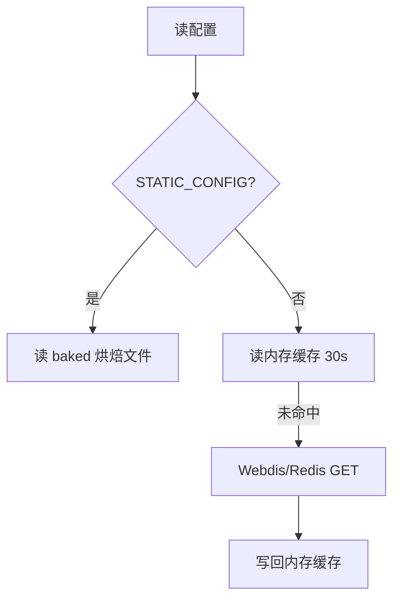
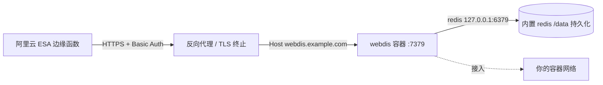

# 13 · Redis / Webdis 外置 KV（全平台支持）

> [!NOTE]
> **本文面向**：开发者（理解配置持久化后端如何选型）。
> 平台能力差异见 [系统架构 · 平台降级](/dev/11-architecture.md)。

---

## 为什么需要它

Cloudflare / EdgeOne 有原生 KV（`CDN_KV`），配置直接存进去读写都方便。
但 **阿里云 ESA 没有可用原生 KV**（EdgeKV 按计费策略被本项目统一禁用），代码不能依赖运行时 KV。

于是引入 **Webdis / Redis 外置后端**：用一组 HTTP 接口（Webdis）把配置存到你自己的 Redis。

> [!IMPORTANT]
> **它不只是 ESA 的兜底**。**所有平台**（Cloudflare / EdgeOne / 阿里云 ESA）都支持外置自部署 Webdis，
> 且可与平台级 KV **同时存在**。两者都可用时，**默认优先使用 Webdis**——
> 这样你的配置就掌握在自己的 Redis 里，跨平台迁移无需搬运数据。
> 想切回平台 KV 时把环境变量 `KV_BACKEND` 设为 `native` 即可（见下）。

```mermaid
flowchart LR
    A[网关代码] -->|getKV()| B{KV_BACKEND?}
    B -->|auto 默认| D[Webdis/Redis<br/>REDIS_URL]
    B -->|native| C[平台原生 KV<br/>CDN_KV / KV]
    B -->|redis| D
    D -.->|未配置则降级| C
    C -.->|未绑定则降级| D
    D --> E[(你的 Redis 实例)]
```

---

## 后端选型：KV_BACKEND

选型开关是**环境变量** `KV_BACKEND`（不是配置项）：

| 取值 | 行为 |
|---|---|
| 未设置 / `auto` | **默认自部署 Webdis 优先**；未配 `REDIS_URL` 时用平台 KV |
| `native` | 强制平台 KV（`CDN_KV` / `KV`）；无绑定时降级到 Webdis |
| `redis` | 强制自部署 Webdis（`REDIS_URL`）；未配置时降级到平台 KV |

偏好侧不可用时**自动降级到另一侧**，而不是直接失去持久化——避免误配开关把配置读写搞挂。

> [!WARNING]
> **为什么必须用环境变量而不是后台配置项？**
> 配置本身就存放在 KV 里。如果把「用哪个 KV 后端」写进 `cfg:global`，
> 就会形成「读配置前必须先知道用哪个后端」的**循环依赖**。
> 因此该开关只来自平台环境变量，管理面**只读展示**。修改后需重新部署生效。

> [!CAUTION]
> **切换后端不会自动迁移数据。** 平台 KV 与 Webdis 是两份独立存储，
> 切换 `KV_BACKEND` 后原后端里的配置将不可见（数据仍在，只是不再被读取）。
> 切换前请先在「系统设置 → 导出配置」备份，切换后重新导入。

---

## 工作原理

`src/platform/kv.js` 拆成三个函数，职责清晰：

| 函数 | 作用 |
|---|---|
| `getNativeKV(env)` | 只探测平台原生 KV：`env.CDN_KV` / `env.KV`，以及 EO 的**运行时全局变量** `globalThis.CDN_KV` |
| `getRedisKV(env)` | 只构造 Webdis 适配器（依赖 `env.REDIS_URL`） |
| `getKV(env)` | 按 `KV_BACKEND` 决策两者顺序，取首个可用者；都不可用返回 `null`（上层降级到默认配置） |

> [!NOTE]
> **ESA 跳过厂商 EdgeKV**：ESA 的 EdgeKV 按量收费且无免费额度，本项目统一禁用，
> 因此 ESA 上 `getNativeKV()` 恒返回 `null`，持久化只能走 `REDIS_URL`。

Webdis 是一个把 Redis 命令暴露成 HTTP 的服务，例如：

```
GET  /GET/key
SET  /SET/key/value
DEL  /DEL/key
```

网关通过 `fetch` 调 Webdis 完成读写，**完全走 HTTP，不需要 Redis 客户端库**。

> [!NOTE]
> ESA 每请求子请求上限 **32**（Cache 与 fetch 共享），Webdis 调用也占这个预算。
> 所以配置读取要有内存缓存（见下），不能每次请求都打 Redis。

---

## 两层缓存，避免打爆 Redis

`src/config/store.js`：

1. **内存缓存 30s**（`kvTtlSeconds` / `kvRefreshStaleSeconds`）：热点配置在节点内存里，陈旧期内返回旧值并后台刷新。
2. **静态烘焙兜底**：设 `STATIC_CONFIG=1`，构建时把配置烤进 `baked.generated.js`，运行时**完全不依赖 KV/Redis**（最稳，适合配置不常变的场景，只读）。



### ESA 的烘焙模式何时启用

`esa/index.js` 按 `REDIS_URL` **自动**选择，不再无条件烘焙：

| 控制台设置 | 结果 |
|---|---|
| 配了 `REDIS_URL`，未设 `STATIC_CONFIG` | **可写模式**，走 Webdis（与 CF / EO 行为一致） |
| 未配 `REDIS_URL`，未设 `STATIC_CONFIG` | **静态烘焙只读**（兜底，避免「既不能读也不能存」的死状态） |
| 显式 `STATIC_CONFIG=1` | 强制只读烘焙（即使配了 `REDIS_URL`） |
| 显式 `STATIC_CONFIG=0` | 强制可写（无 `REDIS_URL` 时配置无法保存） |

---

## 验证连通性（双后端）

管理面「系统信息 → KV 存储后端 → 测试连通性（平台 KV + Webdis）」**一次点击同时探测两端**，
分别显示各自的延迟 / 错误，并标注当前生效后端。

对应 API 为 `/kv/ping`：

```bash
curl "https://你的网关域名/__panel/api/kv/ping" -H "cookie: ecw_token=$TOK"
```

```json
{
  "backend": "redis",
  "preference": "auto",
  "ok": true,
  "latencyMs": 12,
  "native": { "ok": true,  "latencyMs": 8,  "backend": "native",       "effective": false },
  "redis":  { "ok": true,  "latencyMs": 12, "backend": "redis-webdis", "effective": true  }
}
```

| 字段 | 含义 |
|---|---|
| `backend` | 当前**生效**后端：`native` / `redis` / `none` |
| `preference` | `KV_BACKEND` 归一值：`auto` / `native` / `redis` |
| `native` / `redis` | 两端**各自**的读写回环结果（`ok` / `latencyMs` / `error`），`effective` 标记谁在生效 |
| 顶层 `ok` / `latencyMs` | 生效后端的探测结果（兼容旧调用方） |

两端探测**并发执行**，均为「随机 key 写入 → 读回校验 → 删除」的真实读写回环，
未配置的一侧返回 `backend: "none"` 与说明性 `error`，不计为失败。

---

## 运维要点

| 场景 | 建议 |
|---|---|
| 配置常变 | 用 `REDIS_URL` + 内存缓存（30s 最终一致） |
| 配置基本不动 | `STATIC_CONFIG=1` 烘焙，最稳、零运行时依赖（只读） |
| Redis 挂了 | 内存缓存撑 30s 陈旧期；烘焙模式不受影响 |
| 跨节点一致 | 烘焙模式天然一致；Webdis 模式靠 Redis 单一数据源 |
| 多平台同一份配置 | 各平台都指向同一个 Webdis（默认即优先 Webdis），配置天然共享 |
| 已有平台 KV，想改用 Webdis | 先导出配置 → 配 `REDIS_URL`（默认即生效）→ 重新导入 |
| 想从 Webdis 退回平台 KV | 先导出配置 → 设 `KV_BACKEND=native` 并重新部署 → 重新导入 |

---

## 自建 Webdis 服务端（自部署教程）

> 前面讲的是「用现成 Webdis」的原理。如果你**没有可用的 Webdis 实例**（比如不想依赖第三方托管），
> 可以在自己的 VPS 上用 Docker 自建一个，专门给 ESA 当 KV 后端。
> 下面是一套**最小可生产**的部署方式：用官方 `nicolas/webdis` 镜像内置的 Redis 当存储（挂卷持久化），
> 经标准子域名 `webdis.example.com` 暴露（反向代理由你按自身环境配置），仅放行白名单命令 + Basic Auth。

### 架构



> **标准子域名暴露**：给 Webdis 分配一个独立子域名（下面统一用 `webdis.example.com` 作为示例），
> 由你自己的反向代理（Traefik / nginx 等）做域名解析 + TLS 终止后转发到容器 `:7379`。
> `redis-kv.js` 会用 `REDIS_URL` 拼接出 `https://webdis.example.com/GET/key` 这类根路径请求，
> 所以**不需要任何路径前缀或 rewrite**，标准子域名即可，无需改代码。

### 文件清单

放在 `docs/dev/webdis/`（与本文同属 `docs/dev`，便于取用）：

| 文件 | 作用 |
|---|---|
| `docker-compose.yml` | 服务定义、Traefik labels、卷挂载 |
| `webdis.prod.json` | Webdis 配置：连内置 redis、Basic Auth + 命令白名单 |
| `redis.conf` | 内置 redis 持久化配置（覆盖官方 `/tmp` 默认） |

### docker-compose.yml

```yaml
services:
  webdis:
    image: nicolas/webdis:latest
    container_name: webdis
    restart: unless-stopped
    # 覆盖官方默认 CMD：用自定义持久化 redis.conf 启动内置 redis，
    # 再用自定义 webdis.prod.json 启动 webdis（不跑默认 /tmp 非持久配置）。
    command: ["/bin/sh", "-c", "redis-server /etc/redis.conf && exec webdis /etc/webdis.prod.json"]
    environment:
      - TZ=Asia/Shanghai
    volumes:
      # 覆盖官方镜像内 /etc/redis.conf（/tmp 非持久）为持久化配置
      - ./redis.conf:/etc/redis.conf:ro
      # 覆盖官方默认 /etc/webdis.prod.json
      - ./webdis.prod.json:/etc/webdis.prod.json:ro
      # 持久化数据目录（AOF + RDB + pidfile 落在这里，bind mount 便于直接查看/管控）
      # 注意：宿主机目录必须可被容器内 nonroot 用户（UID/GID 65532）写入，
      # 否则 Redis 写 pidfile / appendonlydir 会 Permission denied → 容器崩溃重启循环。
      # 启动前务必执行下面的 chown（见「部署步骤」第 0 步）。
      - ./webdis-data:/data
    networks:
      - web
    labels:
      - traefik.enable=true
      # 标准子域名暴露：给 webdis 分配独立子域名 webdis.example.com
      - traefik.http.routers.webdis.rule=Host(`webdis.example.com`)
      - traefik.http.routers.webdis.entrypoints=websecure
      - traefik.http.routers.webdis.tls=true
      - traefik.http.services.webdis.loadbalancer.server.port=7379
    logging:
      driver: "json-file"
      options:
        max-size: "100m"
        max-file: "2"

networks:
  # 接入你自己的容器网络（请替换 web 为你实际运行反代/发现的网络名）
  web:
    external: true
```

### webdis.prod.json

```json
{
  "redis_host": "127.0.0.1",
  "redis_port": 6379,
  "redis_auth": null,

  "http_host": "0.0.0.0",
  "http_port": 7379,

  "threads": 4,

  "daemonize": false,

  "database": 0,

  "acl": [
    {
      "enabled": []
    },
    {
      "http_basic_auth": "esa:CHANGE_ME_STRONG_PASSWORD",
      "enabled": [ "GET", "SET", "SETEX", "DEL", "EXISTS", "PING" ]
    }
  ],

  "hiredis": {
    "keep_alive_sec": 15
  },

  "verbosity": 3,
  "logfile": "/dev/stderr"
}
```

> **安全说明**：`http_basic_auth` 是明文 `user:password`，Webdis 会校验 `Authorization: Basic base64("user:password")`。
> 上面的 `CHANGE_ME_STRONG_PASSWORD` 是占位符，**部署前必须替换成强密码**。
> 第一条 ACL（`"enabled": []`）表示**未带正确 Basic Auth 的客户端一律拒绝**——这是关键，否则 Redis 会被裸暴露。

### redis.conf

```ini
# Webdis 内置 redis 持久化配置（覆盖官方镜像默认的 /tmp 非持久设置）
port 6379
bind 127.0.0.1

# 持久化目录（挂卷 webdis-data:/data）
dir /data

# AOF + RDB 双保险
appendonly yes
appendfsync everysec
save 900 1
save 300 10
save 60 10000

# 内存上限与淘汰策略
maxmemory 200mb
maxmemory-policy allkeys-lru

# 后台守护进程运行：compose 的 command 是
#   redis-server /etc/redis.conf && exec webdis ...
# 若 daemonize=no，redis-server 会占住前台、webdis 永远起不来 → 7379 无人监听。
# 必须 daemonize yes，让 redis 后台化、redis-server 立即返回，webdis 才能接着启动。
daemonize yes
logfile ""
pidfile /data/redis.pid
```

### 部署步骤

> [!IMPORTANT]
> **数据目录权限（必做，否则容器崩溃重启循环）**
> `nicolas/webdis` 镜像在运行时以**非 root 用户**运行（UID/GID = `65532`，容器内用户名为 `nonroot`），
> 不是 root。日志里反复出现的
> `# Failed to write PID file: Permission denied` 和
> `# Can't open or create append-only dir appendonlydir: Permission denied`
> 就是因为这个：宿主机 `./webdis-data` 目录的属主不是 `65532`，Redis 写 PID / AOF 目录被拒，进程退出后被 `restart: unless-stopped` 不断拉起。
>
> 采用 **bind mount + 修正宿主机目录属主** 的方案：既能让你直接在宿主机查看/管控 `webdis-data` 里的 RDB/AOF，
> 又保持镜像默认的最小权限（不强制 root 运行），是两者兼得的推荐做法。
>
> **第 0 步 · 修复数据目录属主**（在 VPS 上、启动容器前执行）：

```bash
cd /opt/webdis   # 或你放 docker-compose.yml 的目录

# 确保目录存在，并改为容器内 nonroot 用户的 UID/GID（65532）
mkdir -p ./webdis-data
chown -R 65532:65532 ./webdis-data
chmod 755 ./webdis-data
```

> 若目录里已有需要保留的旧数据，`chown` 只改属主、不动文件内容，数据仍在且可直接查看。
> 不想每次手动记 UID，可把上面三行写进部署脚本 / Makefile，作为 `up` 前的准备步骤。

1. **改密码**：编辑 `webdis.prod.json`，把 `esa:CHANGE_ME_STRONG_PASSWORD` 换成真实强密码。
2. **生成 ESA 侧 token**（在 VPS 上执行，仅看输出，不对外泄露）：

   ```bash
   printf 'esa:你的强密码' | base64
   # 得到一串 base64（如 ZXNhOe...），直接把这一整串填进 REDIS_TOKEN
   ```

   > ⚠️ `REDIS_TOKEN` **只需填 `base64` 输出这串凭证**（不带换行），代码会自动补 `Basic ` 前缀，
   > 例如填 `ZXNhOe...` 实际发送 `Basic ZXNhOe...`。**不要再手动加 `Basic ` 前缀**——
   > 尤其 EdgeOne 等「变量值禁止空格/换行」的平台，带 `Basic ` 前缀会因含空格报错无法保存。
   > 若坚持写完整 `Basic xxx` / `Bearer xxx`，代码会识别已带前缀而原样使用，行为不变。
   > **代码不会帮你再做一次 base64**——若填成 `Basic <base64("esa:你的强密码")>` 这种伪代码文本，
   > 服务端收到的凭据非法，会持续 401/403。

3. **启动**：

   ```bash
   cd docs/dev/webdis
   # 若之前跑过旧容器，先 down 再用新目录属主重建
   docker compose down
   docker compose up -d
   docker compose logs -f webdis   # 确认不再有 Permission denied，redis 正常加载 /data
   ```

   > 正常日志应看到 `Server initialized` 后**没有** `Permission denied`；
   > 若仍出现该错误，回到第 0 步确认 `./webdis-data` 属主确为 `65532:65532`（`ls -ld ./webdis-data`）。

### 验证

```bash
# 写（带 Basic Auth）
curl -u 'esa:你的强密码' -X POST -d 'hello' \
  https://webdis.example.com/SET/esa:test

# 读
curl -u 'esa:你的强密码' https://webdis.example.com/GET/esa:test
# → {"GET":"hello"}

# 无密码应被拒
curl https://webdis.example.com/GET/esa:test
# → 401/403

# 危险命令应被禁（白名单未放行）
curl -u 'esa:你的强密码' -X POST https://webdis.example.com/FLUSHALL
# → 403 Forbidden
```

**持久化验证**：重启容器后再次 `GET/esa:test` 仍能读到，说明 `/data` 卷生效。

```bash
docker compose restart webdis
curl -u 'esa:你的强密码' https://webdis.example.com/GET/esa:test
# → {"GET":"hello"}
```

### 网关侧变量（三平台通用）

在部署平台的环境变量里设置（Cloudflare Workers / EdgeOne / 阿里云 ESA 均相同）：

| 变量 | 值 | 说明 |
|---|---|---|
| `REDIS_URL` | `https://webdis.example.com` | Webdis 根地址，注意**不带尾斜杠**。配上即启用 Webdis 后端 |
| `REDIS_TOKEN` | `ZXNhOv...`（base64 串，见下方生成命令输出） | `Authorization` 头值。**只需填 base64 凭证串，代码自动补 `Basic ` 前缀**（也可填完整 `Basic xxx`/`Bearer xxx`，已带前缀则原样用）。**代码不二次 base64 编码**。EdgeOne 等禁空格平台务必只填 base64 串、不要带 `Basic ` 前缀 |
| `REDIS_PREFIX` | `esa:`（可选） | 键前缀，便于识别 / 多项目共库。**未设置时按 `CLOUD_PLATFORM` 自适应默认前缀**（`cf:` / `eo:` / `esa:`）；显式设为空串 `""` 表示主动不要前缀 |
| `REDIS_DB` | `0`–`15` | 多库隔离，见下 |
| `REDIS_TIMEOUT_MS` | `5000` | 单次请求超时，默认 5000ms |
| `KV_BACKEND` | `auto` / `native` / `redis` | 后端选型；不填即 `auto`（**默认 Webdis 优先**） |
| `STATIC_CONFIG` | `1` / `0` | 静态烘焙只读模式；ESA 在未配 `REDIS_URL` 时默认为 `1` |

改完变量后**重新部署**使环境变量生效，再到管理面点「测试连通性（平台 KV + Webdis）」，
确认 Webdis 一侧为 ✅ 且标记为「当前生效」。

### 回滚 / 排障

- **webdis 起不来 / 反复重启**：`docker compose logs webdis`，优先看是否 `Failed to write PID file: Permission denied` 或 `Can't open or create appendonly dir appendonlydir: Permission denied`。这是**数据目录属主不对**——`nicolas/webdis` 镜像以非 root 用户（UID/GID 65532）运行，而宿主机 `./webdis-data` 属主不是它。执行第 0 步的 `chown -R 65532:65532 ./webdis-data` 后 `docker compose down && docker compose up -d` 即可。
- **redis.conf 权限问题**：若去掉 redis.conf 挂载能起来，说明配置文件本身有问题，可临时移除以官方默认配置排障。
- **Redis 起来了但 7379 连不上（curl 连接被重置 / Failed to connect）**：日志里能看到 `Ready to accept connections`、却始终没有 webdis 监听端口，根因几乎都是 `redis.conf` 里 `daemonize no`——`redis-server` 占住前台，`&&` 后的 `webdis` 永远执行不到。确认 `redis.conf` 的 `daemonize` 为 `yes`，然后 `docker compose down && docker compose up -d` 重建。
- **反向代理路由不生效**：确认容器已接入你配置的网络（即 compose 里 `web` 对应的实际网络），且反代已正确设置 `Host(webdis.example.com)` 并指向容器 `:7379`；在反代面板看是否出现 `webdis` router。
- **ESA 报 401/403**：`REDIS_TOKEN` 的 base64 与 `webdis.prod.json` 密码不一致；注意 base64 不要带换行。
- **彻底移除**：`docker compose down -v`（连卷删除，数据清空）；仅停服务用 `docker compose down`（保留卷）。

---

## 多 DB 隔离（预留多项目/多租户）

内置 Redis 默认启用 **16 个逻辑库（0–15）**，全部可用。Webdis 原生支持在 URL 路径首段选库：`/3/GET/key` 即落到 DB 3，**与 Redis 直连 `SELECT 3` 的库号 1:1 对应**，各库之间物理隔离（FLUSHDB、KEYS 互不串）。

> `webdis.prod.json` 里的 `"database": 0` 只是「不指定库时的默认值」，并**没有**把 1–15 锁死——之前 DB 1–15 看似闲置，是因为 `redis-kv.js` 拼出的请求不带库号段，默认全落在 DB 0。

### 用法

给每个需要隔离的项目/租户分配一个固定的 `REDIS_DB`，在部署环境变量里设置即可：

| 变量 | 取值 | 说明 |
|---|---|---|
| `REDIS_DB` | `0`–`15` 的整数 | 不填或非法值回退到 `0`；`>0` 时 `redis-kv.js` 自动在每条命令前插入 `/{db}` 路径段 |

例如 `REDIS_DB=3` 时，适配器实际请求变为 `https://webdis.example.com/3/GET/key`，数据只落在 DB 3，与 DB 0/1/2/4… 完全隔离。

### 约定（建议）

- 建一张库号分配表，记录「哪个项目 → 哪个 DB → 走哪条路径」，避免冲突。
- `REDIS_DB` 与 `REDIS_PREFIX` 可叠加使用：`REDIS_DB=3` + `REDIS_PREFIX=projA:` 是「库级 + 键级」双重隔离。
- 当前 Webdis 的 ACL 只按 Basic Auth 账号控制命令白名单，**不能按 DB 授权**，DB 隔离依赖约定 + 路径，请勿把高危账号共享给不信任项目。

---

## 下一步

→ [部署 ESA](/dev/14-deploy-esa.md)：把网关真正跑上阿里云 ESA。
