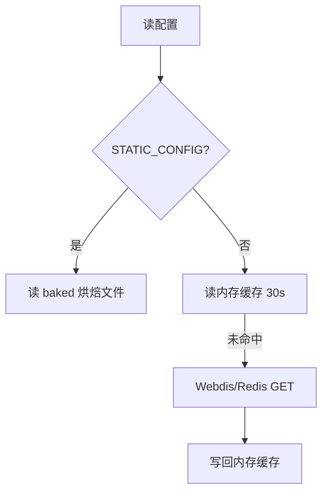

# 13 · Redis / Webdis KV 兜底

> [!NOTE]
> **本文面向**：开发者（理解无原生 KV 平台怎么存配置）。
> 平台能力差异见 [系统架构 · 平台降级](/dev/11-architecture.md)。

---

## 为什么需要兜底

Cloudflare / EdgeOne 有原生 KV（`CDN_KV`），配置直接存进去读写都方便。
但 **阿里云 ESA 没有可用原生 KV**（EdgeKV 按计费策略被本项目统一禁用），代码不能依赖运行时 KV。

于是引入 **Webdis / Redis 兜底**：用一组 HTTP 接口（Webdis）把配置存到外部 Redis，
让 ESA 上也能「像有 KV 一样」读写配置。

```mermaid
flowchart LR
    A[网关代码] -->|getKV()| B{平台?}
    B -->|cf/eo| C[原生 CDN_KV]
    B -->|esa| D[Webdis/Redis<br/>REDIS_URL]
    D --> E[(Redis 实例)]
```

---

## 工作原理

`src/platform/kv.js` 的 `getKV()`：

1. `CLOUD_PLATFORM=cf|eo` → 用 `CDN_KV` 绑定。
2. `CLOUD_PLATFORM=esa` → 跳过 EdgeKV，返回 Webdis KV 适配器（基于 `env.REDIS_URL`）。

Webdis 是一个把 Redis 命令暴露成 HTTP 的服务，例如：

```
GET  /GET/key
SET  /SET/key/value
DEL  /DEL/key
```

网关通过 `fetch` 调 Webdis 完成读写，**完全走 HTTP，不需要 Redis 客户端库**。

> [!NOTE]
> ESA 每请求子请求上限 **32**（Cache 与 fetch 共享），Webdis 调用也占这个预算。
> 所以配置读取要有内存缓存（见下），不能每次请求都打 Redis。

---

## 两层缓存，避免打爆 Redis

`src/config/store.js`：

1. **内存缓存 30s**（`kvTtlSeconds` / `kvRefreshStaleSeconds`）：热点配置在节点内存里，陈旧期内返回旧值并后台刷新。
2. **静态烘焙兜底**：ESA 可设 `STATIC_CONFIG=1`，构建时把配置烤进 `baked.generated.js`，运行时**完全不依赖 KV/Redis**（最稳，适合配置不常变的场景）。



---

## 验证兜底连通性

管理面 / API 提供 `/kv/ping`：

```bash
curl "https://你的网关域名/__panel/api/kv/ping" -H "cookie: ecw_token=$TOK"
# → {"ok":true,"backend":"redis-webdis","latencyMs":12}
```

`backend` 字段告诉你当前用的是原生 KV 还是 Webdis 兜底。

---

## 运维要点

| 场景 | 建议 |
|---|---|
| ESA 配置常变 | 用 `REDIS_URL` + 内存缓存（30s 最终一致） |
| ESA 配置基本不动 | `STATIC_CONFIG=1` 烘焙，最稳、零运行时依赖 |
| Redis 挂了 | 内存缓存撑 30s 陈旧期；烘焙模式不受影响 |
| 跨节点一致 | 烘焙模式天然一致；Webdis 模式靠 Redis 单一数据源 |

---

## 下一步

→ [部署 ESA](/dev/14-deploy-esa.md)：把网关真正跑上阿里云 ESA。
