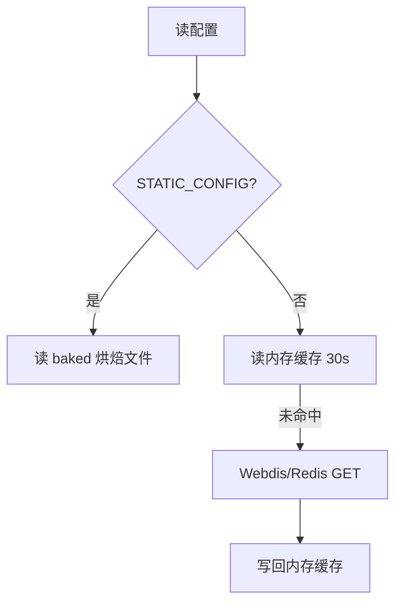
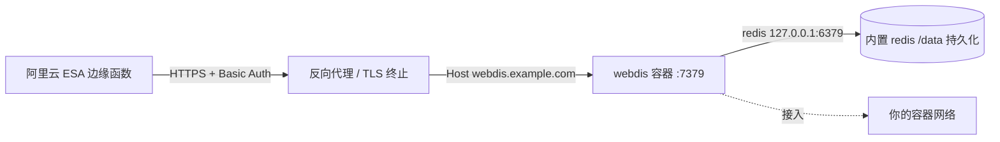

# 13 · Redis / Webdis KV 兜底

> [!NOTE]
> **本文面向**：开发者（理解无原生 KV 平台怎么存配置）。
> 平台能力差异见 [系统架构 · 平台降级](/dev/11-architecture.md)。

---

## 为什么需要兜底

Cloudflare / EdgeOne 有原生 KV（`CDN_KV`），配置直接存进去读写都方便。
但 **阿里云 ESA 没有可用原生 KV**（EdgeKV 按计费策略被本项目统一禁用），代码不能依赖运行时 KV。

于是引入 **Webdis / Redis 兜底**：用一组 HTTP 接口（Webdis）把配置存到外部 Redis，
让 ESA 上也能「像有 KV 一样」读写配置。

```mermaid
flowchart LR
    A[网关代码] -->|getKV()| B{平台?}
    B -->|cf/eo| C[原生 CDN_KV]
    B -->|esa| D[Webdis/Redis<br/>REDIS_URL]
    D --> E[(Redis 实例)]
```

---

## 工作原理

`src/platform/kv.js` 的 `getKV()`：

1. `CLOUD_PLATFORM=cf|eo` → 用 `CDN_KV` 绑定。
2. `CLOUD_PLATFORM=esa` → 跳过 EdgeKV，返回 Webdis KV 适配器（基于 `env.REDIS_URL`）。

Webdis 是一个把 Redis 命令暴露成 HTTP 的服务，例如：

```
GET  /GET/key
SET  /SET/key/value
DEL  /DEL/key
```

网关通过 `fetch` 调 Webdis 完成读写，**完全走 HTTP，不需要 Redis 客户端库**。

> [!NOTE]
> ESA 每请求子请求上限 **32**（Cache 与 fetch 共享），Webdis 调用也占这个预算。
> 所以配置读取要有内存缓存（见下），不能每次请求都打 Redis。

---

## 两层缓存，避免打爆 Redis

`src/config/store.js`：

1. **内存缓存 30s**（`kvTtlSeconds` / `kvRefreshStaleSeconds`）：热点配置在节点内存里，陈旧期内返回旧值并后台刷新。
2. **静态烘焙兜底**：ESA 可设 `STATIC_CONFIG=1`，构建时把配置烤进 `baked.generated.js`，运行时**完全不依赖 KV/Redis**（最稳，适合配置不常变的场景）。



---

## 验证兜底连通性

管理面 / API 提供 `/kv/ping`：

```bash
curl "https://你的网关域名/__panel/api/kv/ping" -H "cookie: ecw_token=$TOK"
# → {"ok":true,"backend":"redis-webdis","latencyMs":12}
```

`backend` 字段告诉你当前用的是原生 KV 还是 Webdis 兜底。

---

## 运维要点

| 场景 | 建议 |
|---|---|
| ESA 配置常变 | 用 `REDIS_URL` + 内存缓存（30s 最终一致） |
| ESA 配置基本不动 | `STATIC_CONFIG=1` 烘焙，最稳、零运行时依赖 |
| Redis 挂了 | 内存缓存撑 30s 陈旧期；烘焙模式不受影响 |
| 跨节点一致 | 烘焙模式天然一致；Webdis 模式靠 Redis 单一数据源 |

---

## 自建 Webdis 服务端（自部署教程）

> 前面讲的是「用现成 Webdis」的原理。如果你**没有可用的 Webdis 实例**（比如不想依赖第三方托管），
> 可以在自己的 VPS 上用 Docker 自建一个，专门给 ESA 当 KV 后端。
> 下面是一套**最小可生产**的部署方式：用官方 `nicolas/webdis` 镜像内置的 Redis 当存储（挂卷持久化），
> 经标准子域名 `webdis.example.com` 暴露（反向代理由你按自身环境配置），仅放行白名单命令 + Basic Auth。

### 架构



> **标准子域名暴露**：给 Webdis 分配一个独立子域名（下面统一用 `webdis.example.com` 作为示例），
> 由你自己的反向代理（Traefik / nginx 等）做域名解析 + TLS 终止后转发到容器 `:7379`。
> `redis-kv.js` 会用 `REDIS_URL` 拼接出 `https://webdis.example.com/GET/key` 这类根路径请求，
> 所以**不需要任何路径前缀或 rewrite**，标准子域名即可，无需改代码。

### 文件清单

放在 `docs/dev/webdis/`（与本文同属 `docs/dev`，便于取用）：

| 文件 | 作用 |
|---|---|
| `docker-compose.yml` | 服务定义、Traefik labels、卷挂载 |
| `webdis.prod.json` | Webdis 配置：连内置 redis、Basic Auth + 命令白名单 |
| `redis.conf` | 内置 redis 持久化配置（覆盖官方 `/tmp` 默认） |

### docker-compose.yml

```yaml
services:
  webdis:
    image: nicolas/webdis:latest
    container_name: webdis
    restart: unless-stopped
    # 覆盖官方默认 CMD：用自定义持久化 redis.conf 启动内置 redis，
    # 再用自定义 webdis.prod.json 启动 webdis（不跑默认 /tmp 非持久配置）。
    command: ["/bin/sh", "-c", "redis-server /etc/redis.conf && exec webdis /etc/webdis.prod.json"]
    environment:
      - TZ=Asia/Shanghai
    volumes:
      # 覆盖官方镜像内 /etc/redis.conf（/tmp 非持久）为持久化配置
      - ./redis.conf:/etc/redis.conf:ro
      # 覆盖官方默认 /etc/webdis.prod.json
      - ./webdis.prod.json:/etc/webdis.prod.json:ro
      # 持久化数据卷（AOF + RDB 落在这里）
      - webdis-data:/data
    networks:
      - web
    labels:
      - traefik.enable=true
      # 标准子域名暴露：给 webdis 分配独立子域名 webdis.example.com
      - traefik.http.routers.webdis.rule=Host(`webdis.example.com`)
      - traefik.http.routers.webdis.entrypoints=websecure
      - traefik.http.routers.webdis.tls=true
      - traefik.http.services.webdis.loadbalancer.server.port=7379
    logging:
      driver: "json-file"
      options:
        max-size: "100m"
        max-file: "2"

networks:
  # 接入你自己的容器网络（请替换 web 为你实际运行反代/发现的网络名）
  web:
    external: true

volumes:
  webdis-data:
```

### webdis.prod.json

```json
{
  "redis_host": "127.0.0.1",
  "redis_port": 6379,
  "redis_auth": null,

  "http_host": "0.0.0.0",
  "http_port": 7379,

  "threads": 4,

  "daemonize": false,

  "database": 0,

  "acl": [
    {
      "enabled": []
    },
    {
      "http_basic_auth": "esa:CHANGE_ME_STRONG_PASSWORD",
      "enabled": [ "GET", "SET", "SETEX", "DEL", "EXISTS", "PING" ]
    }
  ],

  "hiredis": {
    "keep_alive_sec": 15
  },

  "verbosity": 3,
  "logfile": "/dev/stderr"
}
```

> **安全说明**：`http_basic_auth` 是明文 `user:password`，Webdis 会校验 `Authorization: Basic base64("user:password")`。
> 上面的 `CHANGE_ME_STRONG_PASSWORD` 是占位符，**部署前必须替换成强密码**。
> 第一条 ACL（`"enabled": []`）表示**未带正确 Basic Auth 的客户端一律拒绝**——这是关键，否则 Redis 会被裸暴露。

### redis.conf

```ini
# Webdis 内置 redis 持久化配置（覆盖官方镜像默认的 /tmp 非持久设置）
port 6379
bind 127.0.0.1

# 持久化目录（挂卷 webdis-data:/data）
dir /data

# AOF + RDB 双保险
appendonly yes
appendfsync everysec
save 900 1
save 300 10
save 60 10000

# 内存上限与淘汰策略
maxmemory 200mb
maxmemory-policy allkeys-lru

# 前台运行，由容器主进程管理
daemonize no
logfile ""
pidfile /data/redis.pid
```

### 部署步骤

1. **改密码**：编辑 `webdis.prod.json`，把 `esa:CHANGE_ME_STRONG_PASSWORD` 换成真实强密码。
2. **生成 ESA 侧 token**（在 VPS 上执行，仅看输出，不对外泄露）：

   ```bash
   printf 'esa:你的强密码' | base64
   # 得到一串 base64，REDIS_TOKEN = "Basic " + 该串（例如 Basic xxxx，xxxx 即上一步输出）
   ```

3. **启动**：

   ```bash
   cd docs/dev/webdis
   docker compose up -d
   docker compose logs -f webdis   # 确认 webdis 起来、redis 加载了 /data
   ```

### 验证

```bash
# 写（带 Basic Auth）
curl -u 'esa:你的强密码' -X POST -d 'hello' \
  https://webdis.example.com/SET/esa:test

# 读
curl -u 'esa:你的强密码' https://webdis.example.com/GET/esa:test
# → {"GET":"hello"}

# 无密码应被拒
curl https://webdis.example.com/GET/esa:test
# → 401/403

# 危险命令应被禁（白名单未放行）
curl -u 'esa:你的强密码' -X POST https://webdis.example.com/FLUSHALL
# → 403 Forbidden
```

**持久化验证**：重启容器后再次 `GET/esa:test` 仍能读到，说明 `/data` 卷生效。

```bash
docker compose restart webdis
curl -u 'esa:你的强密码' https://webdis.example.com/GET/esa:test
# → {"GET":"hello"}
```

### ESA 侧变量

在 ESA 控制台（或部署平台环境变量）设置，与 [部署 ESA](/dev/14-deploy-esa.md) 的「方式 A」一致：

| 变量 | 值 | 说明 |
|---|---|---|
| `REDIS_URL` | `https://webdis.example.com` | 注意**不带尾斜杠** |
| `REDIS_TOKEN` | `Basic <base64("esa:你的强密码")>` | 作为 `Authorization` 头原样发送 |
| `REDIS_PREFIX` | `esa:` | 键前缀，便于识别 |

改完变量后重新部署 ESA 函数使环境变量生效，再用 `/kv/ping` 确认 `backend` 为 `redis-webdis`。

### 回滚 / 排障

- **webdis 起不来**：`docker compose logs webdis`，多半是 `redis.conf` 权限或 `/data` 不可写；可临时去掉 `redis.conf` 挂载排障。
- **反向代理路由不生效**：确认容器已接入你配置的网络（即 compose 里 `web` 对应的实际网络），且反代已正确设置 `Host(webdis.example.com)` 并指向容器 `:7379`；在反代面板看是否出现 `webdis` router。
- **ESA 报 401/403**：`REDIS_TOKEN` 的 base64 与 `webdis.prod.json` 密码不一致；注意 base64 不要带换行。
- **彻底移除**：`docker compose down -v`（连卷删除，数据清空）；仅停服务用 `docker compose down`（保留卷）。

---

## 下一步

→ [部署 ESA](/dev/14-deploy-esa.md)：把网关真正跑上阿里云 ESA。
