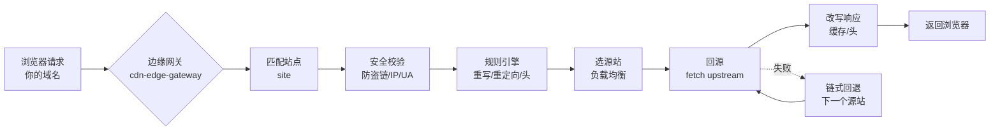

# cdn-edge-gateway 文档中心

> [!NOTE]
> **本文读者**：所有人。这是文档站的首页，帮你快速找到该看的篇章。

**cdn-edge-gateway** 是一个跑在**边缘节点**上的 CDN 反向代理网关。
一句话理解它：把它架在你的源站前面，它就变成了一个「聪明的中间人」——
帮你做多域名接入、多源站负载均衡、链式回退、被动熔断、缓存加速和安全防护，
而且**免费**借用 Cloudflare / EdgeOne / 阿里云 ESA 的边缘算力。

---

## 你是哪一类读者？

下面两张卡片帮你分流。点进去，就能走完「部署 → 配置 → 使用」或「读代码 → 调试 → 扩展」的主线。

<div class="grid cards" markdown>

- :material-account-circle:{ .lg .middle } **我是普通用户（部署 & 使用）**

    ---

    我只想把网关跑起来、把网站加速、配好源站和安全规则。

    [:octicons-arrow-right-24: 进入用户篇](/user/01-overview.md)

- :material-code-braces:{ .lg .middle } **我是开发者（读代码 & 扩展）**

    ---

    我要本地跑起来、看 API、理解架构、改代码或部署到阿里云 ESA。

    [:octicons-arrow-right-24: 进入开发者篇](/dev/09-local-development.md)

</div>

---

## 整体流程一览

不管你在哪个平台部署，一次用户请求的处理链路都是这条流水线：



> [!TIP]
> 想要「一张图看懂」？直接读 [用户篇 · 项目概述](/user/01-overview.md) 的架构图小节；
> 想看每一步代码怎么走，去 [开发者篇 · 请求流程](/dev/12-request-flow.md)。

---

## 支持的平台（三种免费形态）

| 平台 | 部署命令 | 特点 |
|---|---|---|
| Cloudflare Workers | `npm run deploy:cf` | 免费额度大、原生 KV、支持 TCP 回源 |
| Cloudflare Pages | `npm run deploy:pages` | 同上，Pages 形态 |
| EdgeOne Pages | 控制台/CLI 绑定仓库 | 节点本地缓存、`CLOUD_PLATFORM=eo` |
| 阿里云 ESA | `npm run deploy:esa` | 静态烘焙 + REDIS_URL 兜底 KV |

> [!NOTE]
> 阿里云 ESA 部署与 MCP 管理偏进阶，放在 [开发者篇](/dev/14-deploy-esa.md)。

---

## 快速开始（30 秒）

```bash
git clone <你的仓库地址> cdn-edge-gateway
cd cdn-edge-gateway
npm install
npm run dev        # 本地起一个管理面，浏览器打开 http://localhost:8799/__panel
```

然后跟着 [部署指南](/user/03-deploy.md) 把网关真正上线到边缘。

---

## 文档结构

- **用户篇**：概述 · 环境准备 · 部署指南 · 配置详解 · 管理面教程 · 缓存策略 · EO 回源 Host · 常见问题
- **开发者篇**：本地开发 · API 参考 · 系统架构 · 请求流程 · Redis / Webdis 外置 KV · 部署 ESA · ESA MCP
- **附录**：状态码说明 · 隐藏配置字段 · 502 错误说明
