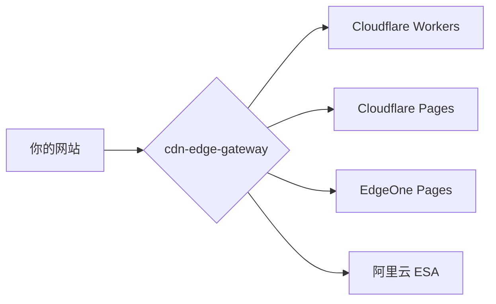
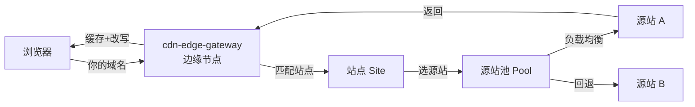

# 01 · 项目概述

> [!NOTE]
> **本文面向**：普通用户（想知道这是什么、能不能用、怎么选）。
> 开发者请看 [开发者篇 · 系统架构](/dev/11-architecture.md)。

---

## 一句话理解

**cdn-edge-gateway** 是一个跑在「边缘节点」上的 CDN 反向代理网关。

再白话一点：把它架在你的源站（真实服务器）前面，它就变成了一个**聪明的中间人**——

- 帮你把多个域名、多台源站接进来做**负载均衡**；
- 源站挂了自动切到下一台（**链式回退**）；
- 反复抽风的源站暂时拉黑（**被动熔断**）；
- 给内容做**边缘缓存**加速；
- 顺手做**防盗链 / IP 封禁 / UA 过滤 / 限流**。

最关键的一点：**它借用 Cloudflare / EdgeOne / 阿里云 ESA 的边缘算力运行，免费额度就能跑起来。**

---

## 它不是什么（避免误会）

| 误解 | 真实情况 |
|---|---|
| 它是一个独立 CDN 厂商 | 不是。它是跑在 CF/EO/ESA 上的**代码**，复用它们的边缘网络 |
| 它自己有硬盘存缓存 | 没有。它只是边缘上的一段代码，缓存靠底层平台的 Cache API |
| 它要买服务器 | 不用。部署到边缘平台，按它们的免费额度运行 |
| 它很难配 | 有网页管理面（点点点就能建站点/源站/规则），不用写代码 |

---

## 三种部署形态（怎么选）



| 形态 | 适合谁 | 部署命令 | 国内节点 |
|---|---|---|---|
| **Cloudflare Workers** | 最省事、自定义域名方便 | `npm run deploy:cf` | 看 CF 节点 |
| **Cloudflare Pages** | 已有 Git 仓库、想自动构建 | `npm run deploy:pages` | 看 CF 节点 |
| **EdgeOne Pages** | 业务在国内、要国内边缘 | 控制台 / CLI 绑仓库 | ✅ 有 |
| **阿里云 ESA** | 想用阿里云、或要做 AI 管理 | 控制台连接仓库自动部署 | ✅ 有 |

> [!TIP]
> 新手直接选 **Cloudflare Workers**，命令最少、自定义域名最方便。
> 国内访问慢就换 **EdgeOne Pages**。阿里云 ESA 偏进阶，见 [开发者篇 · 部署 ESA](/dev/14-deploy-esa.md)。

---

## 架构一图流



四个核心积木：**站点（一个域名）= 谁访问**，**源站池（一组服务器）= 去哪取数据**，**源站 = 真实服务器**，**规则 = 什么条件做什么**。

---

## 核心概念（先记住这四个词）

| 词 | 一句话 | 必填？ |
|---|---|---|
| **站点 Site** | 一个加速域名（如 `img.example.com`） | 必填 |
| **源站池 Pool** | 一组可互换的源站 + 调度策略 | 可选（也可站点直接填源站） |
| **源站 Origin** | 你的真实服务器地址 | 必填 |
| **规则 Rule** | 「什么请求 → 做什么」（分流/改写/拦截/缓存） | 可选 |

> [!NOTE]
> **源站 ≠ 源站池**：源站是一台真实服务器；源站池是把几台源站打包、定个调度策略，方便复用和回退。

---

## 仓库结构速览

```
cdn-edge-gateway/
├── src/            # 网关核心代码（边缘运行时跑的就是它）
├── web/            # 管理面前端（网页后台）
├── docs-site/      # 本教程站工程（MkDocs）
├── build.mjs       # 构建脚本
├── wrangler.toml   # Cloudflare 部署配置
├── edgeone.json    # EdgeOne 部署配置
├── esa.jsonc       # 阿里云 ESA 部署配置
└── scripts/        # 各种辅助脚本（部署/检查/本地开发）
```

---

## 下一步

→ [环境准备](/user/02-prerequisites.md)：把代码拉下来、装好依赖、跑通一次构建。
