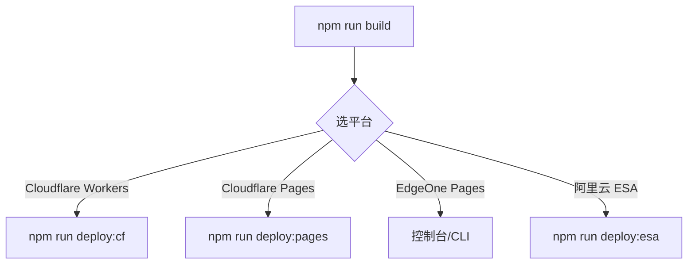

# 03 · 部署指南

> [!NOTE]
> **本文面向**：普通用户（把网关真正上线到边缘）。
> 部署 ESA 的进阶细节见 [开发者篇 · 部署 ESA](/dev/14-deploy-esa.md)。

---

## 部署前先知道两件事

1. **一次本地构建 = 三平台通用产物**：`npm run build` 后，`dist/` + `_worker.js` 三平台都能用，区别只在「怎么推上去」。
2. **EO / ESA 必须声明平台**：部署到 EdgeOne 或 ESA 时，要先设 `CLOUD_PLATFORM=eo`（或 `esa`），否则代码探测不出平台能力会报错。

---

## 路线总览



---

## 路线 A：Cloudflare Workers（推荐新手）

### A.1 网页控制台（最简单，零本地工具）

1. 进 [Cloudflare 控制台 → Workers](https://dash.cloudflare.com/)，新建 Worker，命名如 `cdn-gw`。
2. 把仓库根目录 `_worker.js` 的内容**全选粘贴**进代码编辑器。
3. 设置变量：至少加 `CLOUD_PLATFORM=cf`。
4. 点「部署」，记下分配的 `*.workers.dev` 域名。

> [!TIP]
> 粘贴部署时，管理面靠代码内联兜底（`UI_HTML`）渲染，**无需额外传静态资源**。

### A.2 命令行（本地一键）

```bash
npm run deploy:cf
```

等价于：`build` → 生成 `wrangler.deploy.toml` → `wrangler deploy` → 清理临时配置。
首次会要你登录 Cloudflare 账号。

### A.3 自定义域名（生产必做）

在 Worker 设置里「绑定自定义域」→ 填你的域名（如 `cdn.example.com`）→ 按提示加 DNS 记录。

### A.4 GitHub 流水线（自动部署，推荐团队）

仓库绑定 GitHub 后，用 `wrangler deploy` 行动；CI 跑 `npm run build && npx wrangler deploy`。
（本项目 `deploy:cf` 脚本已封装好本步骤。）

---

## 路线 B：Cloudflare Pages

适合「已有 Git 仓库、想每次 push 自动构建」：

```bash
npm run deploy:pages
```

等价于：`build` → `wrangler pages deploy .`（部署整个目录，含 `dist/public`）。
控制台里「创建 Pages 项目 → 连 Git 仓库」后，每次 push 自动跑构建部署。

---

## 路线 C：EdgeOne Pages（国内节点）

> [!IMPORTANT]
> 部署前**必须**设 `CLOUD_PLATFORM=eo`，否则会部署失败。

1. **控制台（最省事）**
   - EdgeOne 控制台 → 创建 Pages 项目 → 选择 Git 仓库。
   - 构建命令填 `npm run build`，输出目录填 `.`（点号）。
   - 在「环境变量」加 `CLOUD_PLATFORM=eo`。
   - 部署后绑定自定义域（国内访问快）。
2. **CLI**
   ```bash
   export CLOUD_PLATFORM=eo
   npm run build
   edgeone pages deploy .
   ```

> [!WARNING]
> EO 的 `caches.default` 是**节点本地缓存**（清缓存只清当前节点）。大规模清缓存靠「缓存代次」机制，详见 [缓存策略](/user/06-cache-strategy.md)。

---

## 路线 D：阿里云 ESA（进阶）

完整步骤见 [开发者篇 · 部署 ESA](/dev/14-deploy-esa.md)。
这里只给最小可用流程：

```bash
npm run deploy:esa     # 打印 ESA 部署步骤提示
# 然后按提示：ESA 控制台设 REDIS_URL → 提交 → 发布
# 或走 CLI：npm run deploy:esa:cli
```

---

## 部署后验证（三平台通用）

部署完，访问管理面确认活着：

```
https://你的网关域名/__panel
```

能打开登录页就成功了。再访问健康检查：

```bash
curl https://你的网关域名/__health
# 预期返回类似：{"ok":true,"platform":"cf|eo|esa","caps":{...}}
```

> [!TIP]
> `caps` 字段告诉你平台探测到了哪些能力（是否有 KV、是否能 TCP 回源等），排障时很有用。

---

## 常见坑

| 现象 | 原因 | 解法 |
|---|---|---|
| 部署报 `CLOUD_PLATFORM` 相关错误 | EO/ESA 未声明平台 | 设 `CLOUD_PLATFORM=eo` 或 `esa` 后重部署 |
| 管理面打不开 | 路径不是 `__panel` | 确认 global 的 `adminPath`，默认 `__panel` |
| 回源 502 | 源站没放行边缘节点 IP | 见 [附录 · 502](/appendix/502.md) |
| 缓存不生效（EO） | 节点本地缓存 | 用缓存代次清，或换 CF |

---

## 下一步

→ [配置详解](/user/04-configuration.md)：建源站池、建站点、写规则。
