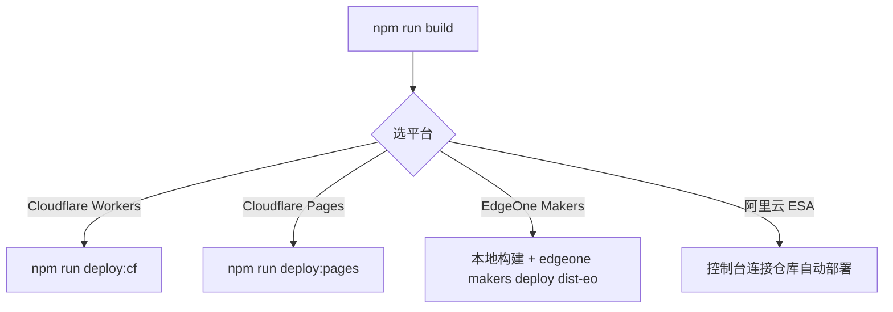

# 03 · 部署指南

> [!NOTE]
> **本文面向**：普通用户（把网关真正上线到边缘）。
> 部署 ESA 的进阶细节见 [开发者篇 · 部署 ESA](/dev/14-deploy-esa.md)。
> **所有要设的变量、各平台绑定与串行部署步骤，已集中到 [部署变量与平台清单](/user/09-env-vars.md)（变量设置唯一入口）。**

---

## 部署前先知道两件事

1. **一次本地构建 = 三平台通用产物**：`npm run build` 后，`dist/` + `_worker.js` 三平台都能用，区别只在「怎么推上去」。
2. **EO / ESA 必须声明平台**：部署到 EdgeOne 或 ESA 时，要先设 `CLOUD_PLATFORM=eo`（或 `esa`），否则代码探测不出平台能力会报错（CF 用官方薄壳或构建烘焙可免设，详见 [变量清单](/user/09-env-vars.md)）。

---

## 路线总览



---

## 路线 A：Cloudflare Workers（推荐新手）

### A.1 网页控制台（最简单，零本地工具）

1. 进 [Cloudflare 控制台 → Workers](https://dash.cloudflare.com/)，新建 Worker，命名如 `cdn-gw`。
2. 把仓库根目录 `_worker.js` 的内容**全选粘贴**进代码编辑器。
3. 设置变量：至少加 `CLOUD_PLATFORM=cf`。
4. 点「部署」，记下分配的 `*.workers.dev` 域名。

> [!TIP]
> 粘贴部署时，管理面靠代码内联兜底（`UI_HTML`）渲染，**无需额外传静态资源**。

### A.2 命令行（本地一键）

```bash
npm run deploy:cf
```

等价于：`build` → 生成 `wrangler.deploy.toml` → `wrangler deploy` → 清理临时配置。
首次会要你登录 Cloudflare 账号。

### A.3 自定义域名（生产必做）

在 Worker 设置里「绑定自定义域」→ 填你的域名（如 `cdn.example.com`）→ 按提示加 DNS 记录。

### A.4 GitHub 流水线（自动部署，推荐团队）

仓库绑定 GitHub 后，用 `wrangler deploy` 行动；CI 跑 `npm run build && npx wrangler deploy`。
（本项目 `deploy:cf` 脚本已封装好本步骤。）

---

## 路线 B：Cloudflare Pages

适合「已有 Git 仓库、想每次 push 自动构建」：

```bash
npm run deploy:pages
```

等价于：`build` → `wrangler pages deploy .`（部署整个目录，含 `dist/public`）。
控制台里「创建 Pages 项目 → 连 Git 仓库」后，每次 push 自动跑构建部署。

---

## 路线 C：EdgeOne Makers（国内节点，推荐）

> [!IMPORTANT]
> EdgeOne **Makers** 与旧版 EdgeOne **Pages** 是两个不同产品。本项目走 **Makers**：
> 本地 `npm run build` 已经把平台探测写进产物（自动 `CLOUD_PLATFORM=eo`），**无需再手动 export**；
> 部署是把本地构建好的 `dist-eo/` 直传到 Makers，**不在云端重新构建**，因此**几乎不消耗构建额度**。

### C.0 部署模型（为什么这样设计）

EdgeOne Makers 的 Edge Functions 运行在 **V8 运行时**，与 Cloudflare Workers 行为高度一致：

- **单运行时收口**：全部请求（数据面代理 + 管理面 `/{adminPath}`）都走 Edge Function（`edge-functions/[[default]].js` 薄壳 → `_worker.js`），不拆 Cloud Function——因为 **EO KV 仅在 Edge Functions 可用**。
- **静态托管 + 函数兜底**：管理面 UI 的静态资源（`dist/public/assets/`）由 Makers 静态层托管，命中后零函数执行；管理面动态页与数据面代理由函数层接管。
- **零云端构建额度**：关键是**本地先 `npm run build` + `node scripts/package-eo.mjs` 生成 `dist-eo/`**，再用 `edgeone makers deploy dist-eo` 上传**本地已构建产物**——此时云端不再 `npm install / npm run build`，免费版每月 500 次构建额度几乎不消耗，每次 deploy 仅计 **1 次部署次数**。若反过来直接 `edgeone makers deploy .`（未先本地 build），CLI 会**自动云端构建**，仍消耗构建额度。这与旧版「控制台连 Git 仓库、每次 push 云端构建」的 Pages 模式有本质区别。

```mermaid
flowchart TD
    A[浏览器请求 /{adminPath}] --> B{EO 静态层}
    B -->|默认 __panel 命中 dist/public/__panel/| C[静态返回管理面]
    B -->|自定义前缀无静态文件| D[edge-functions catch-all 薄壳]
    D --> E[_worker.js 运行时读 KV 取 adminPath]
    E -->|匹配| F[renderAdminPage 动态渲染 /{adminPath}]
    E -->|不匹配| G[renderDisguise 伪装页 502]
```

### C.1 一键脚本（最省事）

```bash
npm run build                              # 本地构建（已内嵌 CLOUD_PLATFORM=eo）
node scripts/package-eo.mjs                # 生成 dist-eo/ 部署包
edgeone makers deploy dist-eo \
  -n <你的 Makers 项目名> \
  -t <EO_SECRET> \
  -e production \
  --json
```

> [!TIP]
> `package-eo.mjs` 负责把 `dist/public/`、`_worker.js`、`edge-functions/[[default]].js` 薄壳、以及默认 `__panel` 静态兜底目录，组装成 Makers 约定的 `dist-eo/` 目录（含 `edgeone.json`）。CNB / GitHub 流水线已封装好这两步。
>
> `EO_SECRET` 是 EdgeOne 访问凭证（CNB 密钥仓库字段 `EO_SECRET` / GitHub Secrets `EO_SECRET`）。`-e production` 指定环境，`--json` 便于流水线解析部署结果。

### C.2 控制台 + CLI（手动）

1. EdgeOne 控制台 → 创建 **Makers** 项目（不是 Pages）。
2. 本地跑 `npm run build` + `node scripts/package-eo.mjs` 生成 `dist-eo/`。
3. 用 CLI 上传（同 C.1 命令），或在 Makers 控制台关联产物目录后点击部署。
4. 部署后绑定自定义域（国内访问快）。

### C.3 流水线自动部署（推荐团队）

- **CNB**：仓库 `.cnb/web_trigger.yml` 的「部署到 EdgeOne Pages」按钮 → 跑 `npm run build` → `node scripts/package-eo.mjs` → `edgeone makers deploy dist-eo --json`，全程本地构建直传。
- **GitHub**：`.github/workflows/deploy-eo-pages.yml` 监听主分支 push / 手动触发，同样本地构建后 `edgeone makers deploy .`。

> [!WARNING]
> **不要**用旧版「EO Pages + Git 仓库 + 输出目录 `.` + `edgeone pages deploy .`」方式部署：那是云端构建范式，既耗构建额度，又与本项目的 Makers 产物结构（`dist-eo/`）不匹配。本项目已统一为 Makers 本地构建直传。

### C.4 V8 运行时兼容（已修复，了解即可）

Makers 的 Edge Functions 跑在 V8，**没有 `node:crypto` 等 Node 内建模块**，且 `process` 全局不一定存在。早期版本因 `_worker.js` 顶层静态 `import ... from 'node:crypto'`，在 Makers 构建期直接失败、导致整个函数层无法挂载、`/{adminPath}` 返回 **404**。已修复：

- `src/config/schema.js`：移除 `node:crypto` 静态 import，改用标准 WebCrypto（`globalThis.crypto`）兜底。
- `src/platform/kv.js`：`process` 访问加 `typeof process !== 'undefined'` 守卫。

修复对 Cloudflare 路径**零回归**（CF 同样可用 WebCrypto，`process` 守卫在 CF 下照常读取 `process.env`）。

### C.5 自定义 adminPath（运行时动态渲染）

管理面入口路径 `global.adminPath` 默认 `__panel`，可在管理面「系统」里改成任意随机前缀并写入 KV。由于部署时前缀未知，**无法靠静态目录覆盖**，改为：

- **默认前缀 `__panel`**：由 `dist-eo/dist/public/__panel/index.html` 静态兜底（零函数执行）。
- **自定义随机前缀**：请求落入函数层 `edge-functions/[[default]].js` 薄壳 → `_worker.js` 路由时从**内存配置快照**读取 `adminPath`（该快照在 isolate 冷启动时由 KV **全量加载一次进内存**，运行时数据面纯内存读取、`不再访问 KV`）→ `renderAdminPage` 动态渲染（注入 `window.__BASE__='/' + adminPath`）。

> [!NOTE]
> **改为前缀无需重新构建、也无需重启**：KV 是「启动初始数据源」。后台按 `cfg:version` 版本号做**分档线性回退**比对（2s 起、600s 封顶），只有版本号变化才整体重拉快照进内存，且并发去重——所以你在管理面改了 `adminPath` 写入 KV 后，各 isolate 会在版本号收敛窗口内自动感知新前缀，无需重新部署。详见 [架构 · 配置同步](/dev/11-architecture.md)。

> 非 `adminPath` 路径（如随机探测 URL）会返回伪装页（见 [附录 · 502](/appendix/502.md)），**不泄露管理面存在**——与 CF 安全门语义一致，不是 bug。

---

## 路线 D：阿里云 ESA（进阶）

完整步骤见 [开发者篇 · 部署 ESA](/dev/14-deploy-esa.md)。
这里只给最小可用流程：

```bash
npm run build          # 本地构建产物（_worker.js + dist/public/）
# 然后：ESA 控制台「函数和 Pages」连接仓库 → 自动读 esa.jsonc 构建部署
# 运行时变量在控制台「环境变量」设置（CLOUD_PLATFORM=esa、REDIS_URL 等）
```
详见 [开发者篇 · 部署 ESA](/dev/14-deploy-esa.md) §4/§5。

---

## 部署后验证（三平台通用）

部署完，访问管理面确认活着：

```
https://你的网关域名/__panel
```

能打开登录页就成功了。如需探测平台能力，可在登录后调用管理面 API（响应头携带 `X-Platform` / `X-Caps` 调试信息），或查看管理面内「平台能力」面板，无需独立的公开健康检查接口。

> [!TIP]
> `caps` 字段告诉你平台探测到了哪些能力（是否有 KV、是否能 TCP 回源等），排障时很有用。

---

## 常见坑

| 现象 | 原因 | 解法 |
|---|---|---|
| 部署报 `CLOUD_PLATFORM` 相关错误 | EO/ESA 未声明平台（`npm run build` 已内嵌，旧手 export 仍可用） | 重跑 `npm run build` 后部署；或 `export CLOUD_PLATFORM=eo` |
| EO 管理面 `/{adminPath}` 返回 **404** | 函数层未挂载（旧版 `node:crypto` 构建失败，已修复） | 升级到含 V8 兼容修复的版本（`dist-eo` 重新 `package-eo` + deploy） |
| EO 管理面返回 **401** + `Tencent Edgeone` 页 | 平台「访问保护」拦截（非应用层问题） | 带有效 `eo_token` cookie 访问，见 [附录 · 502](/appendix/502.md) |
| 管理面打不开 | 路径不是 `__panel` | 确认 global 的 `adminPath`，默认 `__panel` |
| 回源 502 | 源站没放行边缘节点 IP | 见 [附录 · 502](/appendix/502.md) |
| 缓存不生效（EO） | 节点本地缓存 | 用缓存代次清，或换 CF |

---

## 下一步

→ [配置详解](/user/04-configuration.md)：建源站池、建站点、写规则。
