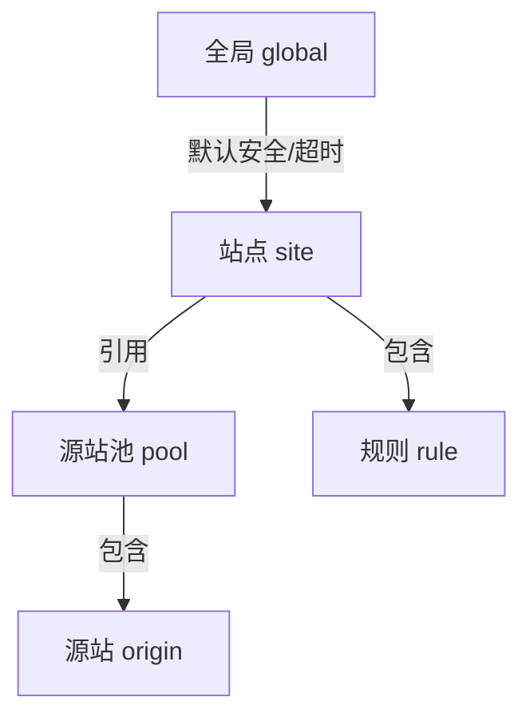

# 04 · 配置详解

> [!NOTE]
> **本文面向**：普通用户（理解配置字段，会配源站/站点/规则）。
> 字段深层含义、平台差异、隐藏字段见 [附录 · 隐藏配置字段](/appendix/hidden-fields.md)。

---

## 配置从哪来

所有配置存在**边缘 KV 或静态烘焙**里（ESA 用 REDIS_URL/烘焙），由代码 `src/config/schema.js` 校验。
你在网页管理面点出来的配置，底层就是这个 JSON。**理解字段 = 理解管理面每个表单项的含义。**

配置分四层：



---

## 一、源站 Origin（最底层，必填）

一台真实服务器。字段：

| 字段 | 必填 | 说明 | 示例 |
|---|---|---|---|
| `id` | ✅ | 唯一标识 | `origin-1` |
| `address` | ✅ | 服务器地址（域名或 IP） | `1.2.3.4` / `origin.internal` |
| `protocol` | | `http` / `https`，默认 `https` | `https` |
| `port` | | 端口，默认按协议 | `443` |
| `weight` | | 权重（配合 `weighted` 策略） | `1` |
| `priority` | | 优先级（链式回退用，数字小优先） | `1` |
| `compress` | | 是否压缩，默认全局 | `true` |

> [!TIP]
> 源站用 `https` 时，源站证书必须有效，否则回源 525/526。自签证书要把 CA 加进源站信任链（平台侧操作）。

---

## 二、源站池 Pool（一组源站 + 调度）

把多台源站打包成一个「可互换集群」，方便负载均衡和回退。

| 字段 | 必填 | 说明 | 示例 |
|---|---|---|---|
| `id` | ✅ | 唯一标识 | `pool-main` |
| `name` | | 显示名 | 主源站 |
| `strategy` | | 调度策略，默认 `round_robin` | `round_robin` / `random` / `weighted` / `hash` / `least_conn` |
| `origins` | ✅ | 源站数组 | `[{id,address...}]` |
| `healthCheck` | | 健康检查（被动为主） | `{enabled:true}` |
| `circuitBreaker` | | 被动熔断参数 | `{enabled:true,threshold:5,resetMs:60000}` |

**调度策略白话**：

| 策略 | 怎么选源站 |
|---|---|
| `round_robin` | 轮流，A→B→A→B（默认，均衡） |
| `random` | 随机 |
| `weighted` | 按 `weight` 权重比例（性能好的多分） |
| `hash` | 按请求特征（如 IP）哈希，同一用户总落同一源站（会话保持） |
| `least_conn` | 选当前连接最少的源站 |

**链式回退**：当优先级最高的源站连不上，自动试下一个 `priority`；全失败才返回 502。

---

## 三、站点 Site（一个加速域名）

| 字段 | 必填 | 说明 | 示例 |
|---|---|---|---|
| `host` | ✅ | 加速域名（站点键） | `img.example.com` |
| `poolId` / `origins` | ✅(二选一) | 引用源站池，或直接填源站 | `pool-main` |
| `match` | | 匹配条件（默认全部） | `{host:"img.example.com"}` |
| `security` | | 本站点安全规则（覆盖全局） | 见下 |
| `rules` | | 规则序列（流量编排） | `[{...}]` |
| `cache` | | 缓存设置 | `{enabled:true}` |
| `sslVerify` | | 回源是否验证书，默认 true | `true` |

> [!NOTE]
> `match` / `security` / `error` 是**全站级默认**的三个阶段（全局通用规则用），属于规则体系一部分，不是隐藏功能。

---

## 四、规则 Rule（流量编排，核心玩法）

规则是按顺序执行的一段「条件 → 动作」。阶段顺序（代码固定）：

```
rewrite(URL重写) → redirect(重定向) → terminate(强制HTTPS/直接响应)
→ reqHeaders(改请求头) → origin(回源规则) → cache(缓存规则) → respHeaders(改响应头)
```

一个规则示例（把 `/api/*` 引到 API 源站池，并加响应头）：

```json
{
  "id": "rule-api",
  "if": { "pathPrefix": "/api/" },
  "stages": {
    "origin": { "poolId": "pool-api" },
    "respHeaders": { "set": { "X-Served-By": "api-cluster" } }
  }
}
```

**字段白话**：

| 字段 | 说明 |
|---|---|
| `if` | 匹配条件（路径前缀、域名、头、查询参数等） |
| `stages.rewrite` | 改写 URL（路径改写、查询串增删） |
| `stages.redirect` | 返回 301/302/307 重定向 |
| `stages.terminate` | 强制 HTTPS，或直接返回固定响应 |
| `stages.reqHeaders` | 给回源请求加/删/改头 |
| `stages.origin` | 动态换源站池（按条件分流） |
| `stages.cache` | 缓存规则（是否缓存、TTL、缓存键） |
| `stages.respHeaders` | 给响应加/删/改头 |

---

## 五、安全 Security（防盗链 / IP / UA / 限流）

在 `global.security` 或 `site.security` 配置，站点级覆盖全局级。

| 字段 | 说明 | 示例 |
|---|---|---|
| `refererCheck` | 防盗链：允许/拒绝的 Referer | `{allow:["example.com"], deny:["*"]}` |
| `ipBlacklist` | IP 黑名单 | `["1.2.3.4"]` |
| `ipWhitelist` | IP 白名单（命中即放行，跳过其它检查） | `["10.0.0.0/8"]` |
| `uaBlocklist` | UA 黑名单 | `["curl","python-requests"]` |
| `uaAllowlist` | UA 白名单 | `["Mozilla/*"]` |
| `rateLimit` | 限流（按 IP/路径计数） | `{limit:100, windowSeconds:60}` |

> [!TIP]
> 防盗链防的是「别人盗用你的资源链接」；IP/UA 过滤防的是「恶意爬虫/扫描」；限流防「刷量压垮源站」。

---

## 六、全局 Global（系统级）

常用全局字段（完整 31 字段见 [附录 · 隐藏配置字段](/appendix/hidden-fields.md)）：

| 字段 | 默认 | 说明 |
|---|---|---|
| `adminPath` | `__panel` | 管理面路径 |
| `securityEnabled` | `true` | 安全总开关 |
| `cacheGen` | `0` | 缓存代次（调它可全局失效旧缓存） |
| `strategy` | `round_robin` | 默认调度策略 |
| `defaultUpstreamTimeoutMs` | `30000` | 默认回源超时 30s |
| `enableCircuitBreaker` | `false` | 被动熔断总开关 |
| `compress` | `true` | 是否压缩 |

---

## 六·五、源站池回源重试（failover）

在源站池（单一源站池 / 源站池）里配置 `failover`，未配置则回落到全站默认的 `stages.origin.failover`。

| 字段 | 默认 | 范围 | 说明 |
|---|---|---|---|
| `enabled` | `true` | bool | 是否启用换源重试 |
| `retryOn` | `[500,502,503,504,522,524]` | 状态码数组 | 命中即换源的状态码 |
| `maxRetries` | `2` | 0–10 | 最多换源次数（不含首次） |
| `timeoutMs` | `10000` | 1000–60000 | 单次回源超时 |
| `maxRetryBodyBytes` | `5242880` | 0–32M | 重试时物化请求体的上限；超大 body（如上传）关闭重试，避免双写 |
| `penaltySeconds` | `15` | 0–600 | **失败即冷却窗口秒数**；一次失败立即把源站放入本边缘冷却名单。仅本 isolate 内存生效、**不跨边缘即时同步**（KV 最终一致传播 1-5s 吃掉 15s 窗收益，属有意接受的代价）；`0`=关闭 |
| `totalTimeoutMs` | `0` | 0–120000 | **整请求回源总时间预算**；`0`=按平台执行上限自动推导（EO/ESA 120s、CF 30s 减安全余量），避免 `(换源次数+1)×超时` 撞平台墙钟 |
| `speculativeMs` | `500` | 0–60000 | **竞速阈值毫秒**；首个源站超时无首字节即并行打第二个候选源站，谁先成功用谁（仅 GET/HEAD 及已物化 body 请求启用，双写安全）；`0`=关闭竞速 |

> [!NOTE]
> **分层兜底保证 100% 取数**：熔断计数跨边缘持久化（KV）；冷却/软恢复/软亲和仅是本边缘内存启发式——某边缘多打一次刚失败的源站，由竞速（500ms 双路）、fail-open 智能放行（全员不可用时挑最近成功源站）、serve-stale（边缘缓存兜底）三道下游兜底，绝不因冷却不即时同步而拒绝服务。
>
> **fail-open 智能放行细节**：当本边缘可用候选集为空（全员熔断/冷却/已试）时，从被排除源站中挑「最近成功时间最新」或「冷却剩余最短」者强行打一次——但**仍会跳过本轮已试过的源站**（避免对已确认失败请求二次重试），仅在仍有未试过的排除候选时生效；若所有源站本轮均已试过，则回落到池内首个源站作为最终兜底，绝不拒绝服务。

---

## 七、常见配置坑

| 坑 | 现象 | 解法 |
|---|---|---|
| 字段名拼错 | 部署前 `npm run check` 报错 | 以 schema 真相源为准，跑 `npm run check` |
| 站点没引用源站池也没填源站 | 请求 502 | 站点必填 `poolId` 或 `origins` |
| 防盗链把自家 Referer 也拦了 | 自己网站图裂 | `refererCheck.allow` 加自己的域名 |
| 回源超时 | 大文件 504 | 调大 `defaultUpstreamTimeoutMs` |
| 缓存不生效 | 回源压力大 | 确认 `cache.enabled=true` 且规则没 `cache` 阶段禁掉 |

---

## 下一步

→ [管理面教程](/user/05-user-guide.md)：不写 JSON，直接在网页上点点点完成上面所有配置。
