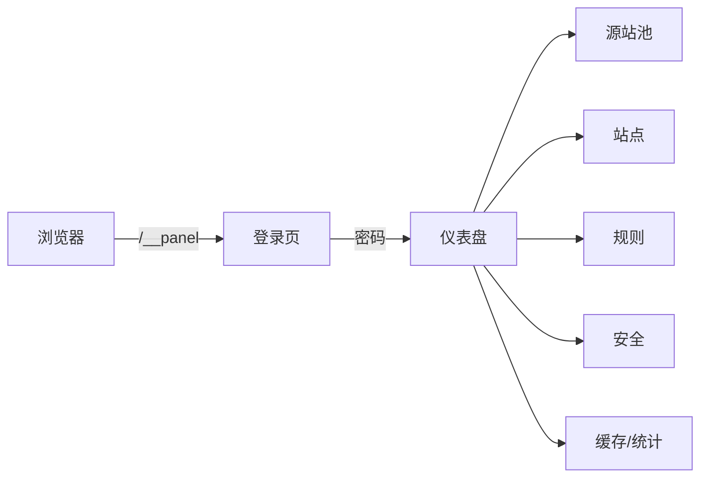

# 05 · 管理面教程

> [!NOTE]
> **本文面向**：普通用户（用网页后台完成所有配置，不用碰 JSON）。
> 想了解配置字段含义，先读 [配置详解](/user/04-configuration.md)。

---

## 进管理面

部署后访问：`https://你的网关域名/__panel`（路径在 `global.adminPath`）。

> [!TIP]
> 本地开发默认密码 `local-dev-pass`（见 [开发者篇 · 本地开发](/dev/09-local-development.md)）。
> 线上部署请在 `global.passwordHash` 设强密码（管理面「修改密码」即可）。

---

## 管理面六大区块

| 区块 | 做什么 |
|---|---|
| 仪表盘 | 总览、平台能力、快速健康检查 |
| 源站池 | 建/删/改源站池、加源站、设调度策略 |
| 站点 | 建域名、绑源站池、配安全、配规则 |
| 流量序列 | 给站点编排规则（可视化顺序） |
| 缓存 | 清缓存（按 URL / 全局代次） |
| 统计 | 各站点命中率、请求量 |
| 系统 | 导入/导出配置、跨站同步、平台信息 |

---

## 实操一：建第一个源站池

1. 进「源站池」→ 点「新建源站池」。
2. 填：
   - 名称：`pool-main`
   - 调度策略：`round_robin`（默认）
   - 源站：点「添加源站」填 `address=你的源站IP`、`protocol=https`、`port=443`
3. 存。页面顶部出现「**保存并发布**」→ 点它，配置写入 KV 立即生效。

> [!WARNING]
> 改完配置**必须点「保存并发布」**，否则只是草稿，不会生效。这是新手最常踩的坑。

---

## 实操二：建站点（绑定域名）

1. 进「站点」→「新建站点」。
2. 填：
   - 加速域名：`img.example.com`（你要加速的那个域名）
   - 源站池：选刚建的 `pool-main`
   - SSL 验证：默认开（源站证书要有效）
3. 存 + 发布。

此时把 `img.example.com` 的 DNS CNAME 到你的网关域名，访问就走网关回源了。

---

## 实操三：配一条规则（流量分流）

场景：把 `/api/` 路径引到另一个 API 源站池。

1. 站点详情 →「流量序列」→「添加规则」。
2. 条件：`路径前缀 = /api/`
3. 动作（阶段）：选 `origin` → 源站池 = `pool-api`
4. 顺序：拖到「默认回源」之前（先匹配特殊路径）。
5. 存 + 发布。

> [!NOTE]
> 规则按顺序执行。上一条 `terminate`（直接响应）或 `redirect` 会中断后续；`origin`/`cache` 只改参数不中断。

---

## 实操四：开安全防护

1. 站点 →「安全」或全局「安全」。
2. 开：防盗链（allow 你的域名）、UA 黑名单（加 `python-requests`/`curl` 挡扫描）、限流（100 次/分钟）。
3. 存 + 发布。

---

## 实操五：清缓存

- **单 URL 清**：缓存 → 填完整 URL → 清。只清当前节点（EO 本地缓存需注意）。
- **全局清**：把 `global.cacheGen` +1，旧键整体失效（推荐大规模刷新用）。
- 见 [缓存策略](/user/06-cache-strategy.md) 讲清缓存本质。

---

## 实操六：看统计

统计 → 选站点，看命中率/请求量曲线。命中率低说明缓存没配好，去调规则 `cache` 阶段。

---

## 新手检查清单

- [ ] 源站池已建 + 至少 1 个源站
- [ ] 站点已建 + 绑了源站池
- [ ] 每次改完都点了「保存并发布」
- [ ] DNS 已 CNAME 到网关域名
- [ ] 管理面能打开 `/__panel`，访问资源不 502

---

## 下一步

→ [缓存策略](/user/06-cache-strategy.md)：把命中率拉满、省源站带宽。
