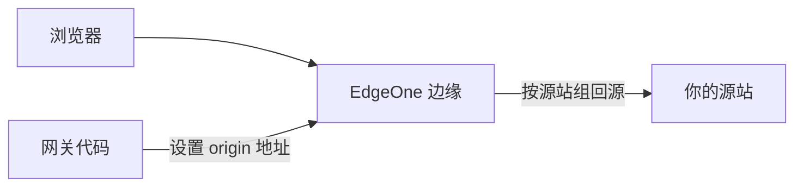

# 07 · EO 回源 Host 配置

> [!NOTE]
> **本文面向**：部署到 **EdgeOne Pages** 的用户（CF / ESA 用户可跳过）。
> 这是 EdgeOne 平台特有的「回源域名（源站组）」操作，不是网关代码配置。

---

## 为什么 EO 要单独配回源 Host

在 Cloudflare 上，网关代码直接 `fetch` 你填的源站地址，Host 头由代码控制。
但 **EdgeOne** 的回源走的是「源站组（Origin Group）」概念，回源域名要在 **EdgeOne 控制台**配，
网关代码里的 origin 地址要和它在控制台配的「源站组」对齐，否则 EO 不知道去哪取数据。

> [!IMPORTANT]
> 网关 `site.origins[].address` 填的域名，必须在 EdgeOne 控制台「源站组」里存在，否则回源失败 502。

---

## 步骤 1：在 EO 控制台建源站组

1. EdgeOne 控制台 → 你的站点 → **源站组**。
2. 新建源站组，填：
   - 源站组名称：`gw-origin`（随意，但要记住）
   - 源站地址：你的真实服务器域名或 IP（和网关配置里 `address` 一致）
   - 回源协议：`HTTPS` / `HTTP`（和网关 `protocol` 一致）
   - 回源 Host（重点）：填你源站认的 Host（通常是源站自有域名）

> [!TIP]
> 「回源 Host」是 EO 发给源站的 `Host` 头。多数情况填源站自己的域名；
> 如果源站靠 Host 区分虚拟主机，这里**必须填对**，否则源站返回默认站点或 404。

---

## 步骤 2：把网关 origin 对齐

在网关管理面（`/__panel`）里，源站池的 `address` 填**和 EO 源站组一致的地址**。
例如控制台源站组填 `origin.internal:443`，网关源站 `address` 也填 `origin.internal`、`port=443`、`protocol=https`。

---

## 步骤 3：规则引擎（可选，强制回源 Host）

如果要在 EO「规则引擎」里强制回源 Host，可加一条「回源请求头 → Host = xxx」的规则，
但更推荐直接在源站组设好，避免和网关 `reqHeaders` 阶段冲突。

---

## 常见坑

| 现象 | 原因 | 解法 |
|---|---|---|
| 502 / 源站 404 | 回源 Host 不对 | EO 源站组 Host 填源站认的域名 |
| 源站组找不到 | 网关 address 和控制台不一致 | 两边地址对齐 |
| HTTPS 握手失败 | 协议不匹配 | 网关 `protocol` 与 EO 源站组协议一致 |

---

## 下一步

→ [常见问题](/user/08-faq.md)：部署/配置/排障高频问题合集。
